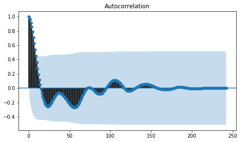
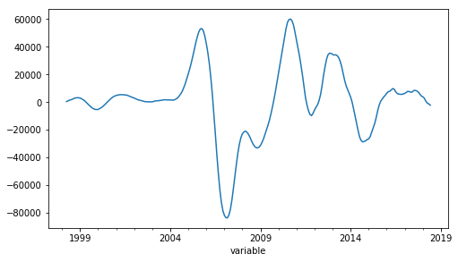

# ARIMA Time Series Forecasting

## Abstract

For this project the goal was to determine three zip codes in the U.S. that may present the best investment opportunities based on ARIMA forecasting. The project demonstrated the ability to develop a methodology for the analysis, followed by acquiring, cleaning and analyzing the data. It also illustrates my understanding of ARIMA forecasting, a fairly technical concept, but presented in a manner in which a non-technical business user could understand and make decisions from.

## Introduction

Residential real estate in the US is big business. The total value of all U.S homes in 2018 is at an all-time high of nearly $32 trillion dollars. That’s more than 1.5 times the US Gross Domestic Product, and continues to increase at a rate of $2 trillion annually.1 The most basic principle of economics states that with increasing demand and scarcity comes an increase in prices as well. In real estate, increased demand is often attributed to population growth or a general uptick in economic prosperity.2 Needless to say, there are great investment opportunities in residential real estate, but without a strategic approach it can be very risky as well. 

This report illustrates a strategic approach using several data sources and time series forecasting in Python to determine three zip codes with the best investment opportunities in the US. In this hypothetical scenario, the recommendations are being made in 2013 to the Syracuse Real Estate Investment Trust (SREIT) on the best investment opportunities for Q1 of 2014. The best opportunities are defined as the greatest forecasted rate of growth with the lowest amount of risk. 

## Data Acquisition

Before I could make investment recommendations, I needed to acquire, clean and explore the necessary data. The initial dataset provided for this project was from Zillow and includes the median home price for each zip code in the US for every month from April 1996 to June 2018. 


```python
#Load packages
import numpy as np
import pandas as pd
from matplotlib import pyplot
from sklearn.metrics import mean_squared_error

import os

os.chdir('/Users/coreylucero/Desktop/Syracuse/IST718 - Advanced Info Analytics/Lab 6')
```


```python
#Import Zillow housing data and inspect
Hdf = pd.read_csv("Zip_Zhvi_SingleFamilyResidence.csv", sep=",", index_col=0)
Hdf.head()
```


<div>
<style scoped>
    .dataframe tbody tr th:only-of-type {
        vertical-align: middle;
    }

    .dataframe tbody tr th {
        vertical-align: top;
    }

    .dataframe thead th {
        text-align: right;
    }
</style>
<table border="1" class="dataframe">
  <thead>
    <tr style="text-align: right;">
      <th></th>
      <th>RegionName</th>
      <th>City</th>
      <th>State</th>
      <th>Metro</th>
      <th>CountyName</th>
      <th>SizeRank</th>
      <th>1996-04</th>
      <th>1996-05</th>
      <th>1996-06</th>
      <th>1996-07</th>
      <th>...</th>
      <th>2017-09</th>
      <th>2017-10</th>
      <th>2017-11</th>
      <th>2017-12</th>
      <th>2018-01</th>
      <th>2018-02</th>
      <th>2018-03</th>
      <th>2018-04</th>
      <th>2018-05</th>
      <th>2018-06</th>
    </tr>
    <tr>
      <th>RegionID</th>
      <th></th>
      <th></th>
      <th></th>
      <th></th>
      <th></th>
      <th></th>
      <th></th>
      <th></th>
      <th></th>
      <th></th>
      <th></th>
      <th></th>
      <th></th>
      <th></th>
      <th></th>
      <th></th>
      <th></th>
      <th></th>
      <th></th>
      <th></th>
      <th></th>
    </tr>
  </thead>
  <tbody>
    <tr>
      <th>84654</th>
      <td>60657</td>
      <td>Chicago</td>
      <td>IL</td>
      <td>Chicago</td>
      <td>Cook</td>
      <td>1</td>
      <td>334200.0</td>
      <td>335400.0</td>
      <td>336500.0</td>
      <td>337600.0</td>
      <td>...</td>
      <td>1008100</td>
      <td>1010800</td>
      <td>1015000</td>
      <td>1021200</td>
      <td>1027600</td>
      <td>1033000</td>
      <td>1035400</td>
      <td>1036200</td>
      <td>1038400</td>
      <td>1038400</td>
    </tr>
    <tr>
      <th>90668</th>
      <td>75070</td>
      <td>McKinney</td>
      <td>TX</td>
      <td>Dallas-Fort Worth</td>
      <td>Collin</td>
      <td>2</td>
      <td>235700.0</td>
      <td>236900.0</td>
      <td>236700.0</td>
      <td>235400.0</td>
      <td>...</td>
      <td>312300</td>
      <td>313900</td>
      <td>315100</td>
      <td>316700</td>
      <td>318900</td>
      <td>321300</td>
      <td>322500</td>
      <td>323300</td>
      <td>324100</td>
      <td>324600</td>
    </tr>
    <tr>
      <th>91982</th>
      <td>77494</td>
      <td>Katy</td>
      <td>TX</td>
      <td>Houston</td>
      <td>Harris</td>
      <td>3</td>
      <td>210400.0</td>
      <td>212200.0</td>
      <td>212200.0</td>
      <td>210700.0</td>
      <td>...</td>
      <td>320100</td>
      <td>320400</td>
      <td>320900</td>
      <td>321200</td>
      <td>322700</td>
      <td>326300</td>
      <td>330100</td>
      <td>332400</td>
      <td>334300</td>
      <td>335600</td>
    </tr>
    <tr>
      <th>84616</th>
      <td>60614</td>
      <td>Chicago</td>
      <td>IL</td>
      <td>Chicago</td>
      <td>Cook</td>
      <td>4</td>
      <td>498100.0</td>
      <td>500900.0</td>
      <td>503100.0</td>
      <td>504600.0</td>
      <td>...</td>
      <td>1288000</td>
      <td>1293000</td>
      <td>1299500</td>
      <td>1303200</td>
      <td>1308700</td>
      <td>1314100</td>
      <td>1316300</td>
      <td>1318500</td>
      <td>1321600</td>
      <td>1318200</td>
    </tr>
    <tr>
      <th>93144</th>
      <td>79936</td>
      <td>El Paso</td>
      <td>TX</td>
      <td>El Paso</td>
      <td>El Paso</td>
      <td>5</td>
      <td>77300.0</td>
      <td>77300.0</td>
      <td>77300.0</td>
      <td>77300.0</td>
      <td>...</td>
      <td>120000</td>
      <td>120400</td>
      <td>120400</td>
      <td>120300</td>
      <td>120400</td>
      <td>120500</td>
      <td>120700</td>
      <td>121200</td>
      <td>122100</td>
      <td>122800</td>
    </tr>
  </tbody>
</table>
<p>5 rows × 273 columns</p>
</div>


```python
#Count number of zip codes in one metro
Hdf.loc[Hdf.Metro == 'Oklahoma City', 'Metro'].count()
```


    70


```python
#Inspect how many Metros are in dataset
Hdf['Metro'].nunique()
```


    731


The full dataset includes 273 columns, 15,245 zip codes making up 731 unique US metropolitan areas. Performing time series forecasting for each individual zip code in the dataset is not practical, therefore I need to create a method for filtering out data that won’t help solve our overarching goal.


```python
#Create list of all years 
yearList = []
for column in Hdf:
    yearList.append(column)
    
del yearList[:6]
```


```python
#Create condensed list of years
CondyearList = []
for column in Hdf:
    CondyearList.append(column)
    
CondyearList = CondyearList[15:219]
```

Once the Zillow data was updated, I began by exploring housing prices for the entire US by looking at how the average housing price changed over time. The sharp rise in housing prices in recent years is clear when looking over average housing prices over the time span, however the Great Recession is also very evident in the late 2000s and early 2010s. 


```python
pd.set_option('display.float_format', lambda x: '%.2f' % x)

#Calculate average price for US houses for each year
M96 = Hdf.iloc[:,6:15].mean(axis=1).mean()
M97 = Hdf.iloc[:,15:27].mean(axis=1).mean()
M98 = Hdf.iloc[:,27:39].mean(axis=1).mean()
M99 = Hdf.iloc[:,39:51].mean(axis=1).mean()
M00 = Hdf.iloc[:,51:63].mean(axis=1).mean()
M01 = Hdf.iloc[:,63:75].mean(axis=1).mean()
M02 = Hdf.iloc[:,75:87].mean(axis=1).mean()
M03 = Hdf.iloc[:,87:99].mean(axis=1).mean()
M04 = Hdf.iloc[:,99:111].mean(axis=1).mean()
M05 = Hdf.iloc[:,111:123].mean(axis=1).mean()
M06 = Hdf.iloc[:,123:135].mean(axis=1).mean()
M07 = Hdf.iloc[:,135:147].mean(axis=1).mean()
M08 = Hdf.iloc[:,147:159].mean(axis=1).mean()
M09 = Hdf.iloc[:,159:171].mean(axis=1).mean()
M10 = Hdf.iloc[:,171:183].mean(axis=1).mean()
M11 = Hdf.iloc[:,183:195].mean(axis=1).mean()
M12 = Hdf.iloc[:,195:207].mean(axis=1).mean()
M13 = Hdf.iloc[:,207:219].mean(axis=1).mean()
M14 = Hdf.iloc[:,219:231].mean(axis=1).mean()
M15 = Hdf.iloc[:,231:243].mean(axis=1).mean()
M16 = Hdf.iloc[:,243:255].mean(axis=1).mean()
M17 = Hdf.iloc[:,255:267].mean(axis=1).mean()
M18 = Hdf.iloc[:,267:].mean(axis=1).mean()

#Condense average values into dataframe
AnnualAvg = pd.DataFrame({'1996': M96,
                          '1997': M97,
                          '1998': M98,
                          '1999': M99,
                          '2000': M00,
                          '2001': M01,
                          '2002': M02,
                          '2003': M03,
                          '2004': M04,
                          '2005': M05,
                          '2006': M06,
                          '2007': M07,
                          '2008': M08,
                          '2009': M09,
                          '2010': M10,
                          '2011': M11,
                          '2012': M12,
                          '2013': M13,
                          '2014': M14,
                          '2015': M15,
                          '2016': M16,
                          '2017': M17,
                          '2018': M18},
                         index=[0])

AnnualAvg = AnnualAvg.transpose()
AnnualAvg.index = pd.to_datetime(AnnualAvg.index)
AnnualAvg = AnnualAvg.rename(columns = {0:'Average Home Value'})
AnnualAvg.plot(legend=None)
pyplot.title('US Home Values - 1996 to 2018')
pyplot.xlabel('Year')
pyplot.ylabel('Average Home Value')
pyplot.show()

```


The recession and recovery has not been equally distributed across the US and has occurred at different rates. To illustrate this, I’ll show the average housing prices for four metro areas in Arkansas: Hot Springs, Little Rock, Fayetteville and Searcy.


```python
#Create function that generates metro time series
def TSMetro(Metro):
    HS = Hdf.loc[Hdf['Metro'] == Metro] #Select metro
    HSavg = HS[CondyearList].mean() #Calculate mean for each year (referencing CondyearList)
    HSdf = HSavg.to_frame() #Convert series to dataframe
    HSdf.columns = [Metro] #Create name for column
    HSdf.index = pd.to_datetime(HSdf.index) #Convert index to date
    return(HSdf)

#Run function for each metro
HS = TSMetro('Hot Springs') 
LR = TSMetro('Little Rock')
FV = TSMetro('Fayetteville')
SC = TSMetro('Searcy')

#Merge all dataframes into one
Ark1 = HS.join(LR, how='outer') #Merge HS and TS
Ark2 = Ark1.join(FV, how='outer') #Merge FV to HS/TS
ArkMetros = Ark2.join(SC, how='outer') #Merge SC to HS/TS/FV
ArkMetros.head()
```


<div>
<style scoped>
    .dataframe tbody tr th:only-of-type {
        vertical-align: middle;
    }

    .dataframe tbody tr th {
        vertical-align: top;
    }

    .dataframe thead th {
        text-align: right;
    }
</style>
<table border="1" class="dataframe">
  <thead>
    <tr style="text-align: right;">
      <th></th>
      <th>Hot Springs</th>
      <th>Little Rock</th>
      <th>Fayetteville</th>
      <th>Searcy</th>
    </tr>
  </thead>
  <tbody>
    <tr>
      <th>1997-01-01</th>
      <td>72225.0</td>
      <td>86772.413793</td>
      <td>79572.222222</td>
      <td>62180.0</td>
    </tr>
    <tr>
      <th>1997-02-01</th>
      <td>72275.0</td>
      <td>87306.896552</td>
      <td>80025.000000</td>
      <td>62440.0</td>
    </tr>
    <tr>
      <th>1997-03-01</th>
      <td>72400.0</td>
      <td>87841.379310</td>
      <td>80458.333333</td>
      <td>62680.0</td>
    </tr>
    <tr>
      <th>1997-04-01</th>
      <td>72575.0</td>
      <td>88410.344828</td>
      <td>80836.111111</td>
      <td>62960.0</td>
    </tr>
    <tr>
      <th>1997-05-01</th>
      <td>72825.0</td>
      <td>88948.275862</td>
      <td>81108.333333</td>
      <td>63220.0</td>
    </tr>
  </tbody>
</table>
</div>


This time series of Arkansas home prices highlights a few things when compared to the US average home price time series shown previously. First, home prices in Arkansas are well below the national average, even at their peak. Second, you can see the impact of the Great Recession in Arkansas was minimal compared to the national average. Lastly, you see the impact of the recession and the recovery afterwards was different for individual communities. Fayetteville saw decreases in home values during this period, but others just saw periods of little to no growth. 


```python
#Plot time series for all four Arkansas metros
ArkMetros.plot()
pyplot.title('Arkansas Metro Average Home Values (1997-2013)')
pyplot.xlabel('Date')
pyplot.ylabel('Price')
pyplot.show()
```


```python
Hts = Hdf.drop(['City','State','Metro','CountyName','SizeRank'], axis=1)
```


```python
pd.set_option('display.float_format', lambda x: '%.2f' % x)

Hdf['96_Mean'] = Hdf.iloc[:,6:15].mean(axis=1)
Hdf['97_Mean'] = Hdf.iloc[:,15:27].mean(axis=1)
Hdf['98_Mean'] = Hdf.iloc[:,27:39].mean(axis=1)
Hdf['99_Mean'] = Hdf.iloc[:,39:51].mean(axis=1)
Hdf['00_Mean'] = Hdf.iloc[:,51:63].mean(axis=1)
Hdf['01_Mean'] = Hdf.iloc[:,63:75].mean(axis=1)
Hdf['02_Mean'] = Hdf.iloc[:,75:87].mean(axis=1)
Hdf['03_Mean'] = Hdf.iloc[:,87:99].mean(axis=1)
Hdf['04_Mean'] = Hdf.iloc[:,99:111].mean(axis=1)
Hdf['05_Mean'] = Hdf.iloc[:,111:123].mean(axis=1)
Hdf['06_Mean'] = Hdf.iloc[:,123:135].mean(axis=1)
Hdf['07_Mean'] = Hdf.iloc[:,135:147].mean(axis=1)
Hdf['08_Mean'] = Hdf.iloc[:,147:159].mean(axis=1)
Hdf['09_Mean'] = Hdf.iloc[:,159:171].mean(axis=1)
Hdf['10_Mean'] = Hdf.iloc[:,171:183].mean(axis=1)
Hdf['11_Mean'] = Hdf.iloc[:,183:195].mean(axis=1)
Hdf['12_Mean'] = Hdf.iloc[:,195:207].mean(axis=1)
Hdf['13_Mean'] = Hdf.iloc[:,207:219].mean(axis=1)
Hdf['14_Mean'] = Hdf.iloc[:,219:231].mean(axis=1)
Hdf['15_Mean'] = Hdf.iloc[:,231:243].mean(axis=1)
Hdf['16_Mean'] = Hdf.iloc[:,243:255].mean(axis=1)
Hdf['17_Mean'] = Hdf.iloc[:,255:267].mean(axis=1)
#Create df for growth rate
a = Hdf[Hdf.columns[0]]
b = Hdf[Hdf.columns[-22:]]
HdfMean = pd.concat([a, b], axis=1)

HdfMean.describe()
```


<div>
<style scoped>
    .dataframe tbody tr th:only-of-type {
        vertical-align: middle;
    }

    .dataframe tbody tr th {
        vertical-align: top;
    }

    .dataframe thead th {
        text-align: right;
    }
</style>
<table border="1" class="dataframe">
  <thead>
    <tr style="text-align: right;">
      <th></th>
      <th>RegionName</th>
      <th>96_Mean</th>
      <th>97_Mean</th>
      <th>98_Mean</th>
      <th>99_Mean</th>
      <th>00_Mean</th>
      <th>01_Mean</th>
      <th>02_Mean</th>
      <th>03_Mean</th>
      <th>04_Mean</th>
      <th>...</th>
      <th>08_Mean</th>
      <th>09_Mean</th>
      <th>10_Mean</th>
      <th>11_Mean</th>
      <th>12_Mean</th>
      <th>13_Mean</th>
      <th>14_Mean</th>
      <th>15_Mean</th>
      <th>16_Mean</th>
      <th>17_Mean</th>
    </tr>
  </thead>
  <tbody>
    <tr>
      <th>count</th>
      <td>15245.00</td>
      <td>14146.00</td>
      <td>14147.00</td>
      <td>14149.00</td>
      <td>14149.00</td>
      <td>14149.00</td>
      <td>14149.00</td>
      <td>14149.00</td>
      <td>14274.00</td>
      <td>14329.00</td>
      <td>...</td>
      <td>14622.00</td>
      <td>14638.00</td>
      <td>14932.00</td>
      <td>14991.00</td>
      <td>15040.00</td>
      <td>15132.00</td>
      <td>15245.00</td>
      <td>15245.00</td>
      <td>15245.00</td>
      <td>15245.00</td>
    </tr>
    <tr>
      <th>mean</th>
      <td>48010.36</td>
      <td>117359.65</td>
      <td>120825.93</td>
      <td>127786.23</td>
      <td>137251.11</td>
      <td>149915.05</td>
      <td>162966.40</td>
      <td>176392.84</td>
      <td>192790.25</td>
      <td>216524.43</td>
      <td>...</td>
      <td>239683.05</td>
      <td>220274.52</td>
      <td>210898.72</td>
      <td>200478.92</td>
      <td>199953.70</td>
      <td>212383.00</td>
      <td>225172.06</td>
      <td>237802.32</td>
      <td>251864.79</td>
      <td>268304.18</td>
    </tr>
    <tr>
      <th>std</th>
      <td>29121.61</td>
      <td>86160.54</td>
      <td>90204.96</td>
      <td>96972.02</td>
      <td>106814.00</td>
      <td>124751.25</td>
      <td>141810.52</td>
      <td>156548.01</td>
      <td>173473.70</td>
      <td>218139.30</td>
      <td>...</td>
      <td>243189.08</td>
      <td>232882.51</td>
      <td>233004.18</td>
      <td>228502.60</td>
      <td>229191.52</td>
      <td>252433.19</td>
      <td>286892.32</td>
      <td>320028.80</td>
      <td>338242.71</td>
      <td>354437.08</td>
    </tr>
    <tr>
      <th>min</th>
      <td>1001.00</td>
      <td>11855.56</td>
      <td>13133.33</td>
      <td>14575.00</td>
      <td>15591.67</td>
      <td>16441.67</td>
      <td>17425.00</td>
      <td>18916.67</td>
      <td>20633.33</td>
      <td>20766.67</td>
      <td>...</td>
      <td>22608.33</td>
      <td>20275.00</td>
      <td>18766.67</td>
      <td>15633.33</td>
      <td>15491.67</td>
      <td>15591.67</td>
      <td>14016.67</td>
      <td>13766.67</td>
      <td>14666.67</td>
      <td>14300.00</td>
    </tr>
    <tr>
      <th>25%</th>
      <td>22443.00</td>
      <td>68277.78</td>
      <td>70716.67</td>
      <td>74900.00</td>
      <td>79366.67</td>
      <td>83491.67</td>
      <td>87758.33</td>
      <td>91516.67</td>
      <td>96583.33</td>
      <td>102791.67</td>
      <td>...</td>
      <td>117393.75</td>
      <td>111122.92</td>
      <td>105604.17</td>
      <td>100416.67</td>
      <td>98997.92</td>
      <td>102031.25</td>
      <td>105558.33</td>
      <td>110491.67</td>
      <td>116450.00</td>
      <td>124241.67</td>
    </tr>
    <tr>
      <th>50%</th>
      <td>46055.00</td>
      <td>98194.44</td>
      <td>100216.67</td>
      <td>105608.33</td>
      <td>112116.67</td>
      <td>119675.00</td>
      <td>126625.00</td>
      <td>133966.67</td>
      <td>142770.83</td>
      <td>154325.00</td>
      <td>...</td>
      <td>175395.83</td>
      <td>161733.33</td>
      <td>154141.67</td>
      <td>146058.33</td>
      <td>144758.33</td>
      <td>150891.67</td>
      <td>157050.00</td>
      <td>162966.67</td>
      <td>171958.33</td>
      <td>183925.00</td>
    </tr>
    <tr>
      <th>75%</th>
      <td>74872.00</td>
      <td>141900.00</td>
      <td>144858.33</td>
      <td>150900.00</td>
      <td>160066.67</td>
      <td>172683.33</td>
      <td>187250.00</td>
      <td>204491.67</td>
      <td>227047.92</td>
      <td>256916.67</td>
      <td>...</td>
      <td>283979.17</td>
      <td>256154.17</td>
      <td>242968.75</td>
      <td>228645.83</td>
      <td>226489.58</td>
      <td>238739.58</td>
      <td>251691.67</td>
      <td>263400.00</td>
      <td>279466.67</td>
      <td>298358.33</td>
    </tr>
    <tr>
      <th>max</th>
      <td>99901.00</td>
      <td>3791966.67</td>
      <td>4077925.00</td>
      <td>4066666.67</td>
      <td>3473200.00</td>
      <td>2968375.00</td>
      <td>3135966.67</td>
      <td>3582225.00</td>
      <td>4040933.33</td>
      <td>10346566.67</td>
      <td>...</td>
      <td>10556433.33</td>
      <td>11289500.00</td>
      <td>12825083.33</td>
      <td>12820833.33</td>
      <td>11135000.00</td>
      <td>11616758.33</td>
      <td>14297525.00</td>
      <td>17264258.33</td>
      <td>18729791.67</td>
      <td>18831466.67</td>
    </tr>
  </tbody>
</table>
<p>8 rows × 23 columns</p>
</div>


```python
# errors
residuals = [test[i]-predictions[i] for i in range(len(test))]
residuals = pd.DataFrame(residuals)
print(residuals.describe())
# report performance
mse = mean_squared_error(test, predictions)
rmse = sqrt(mse)
print('RMSE: %.3f' % rmse)
# plot
residuals.hist(ax=pyplot.gca())
pyplot.show()

residuals.plot(kind='kde', ax=pyplot.gca())
pyplot.show()
```

                     0
    count    81.000000
    mean   2567.289268
    std    3194.845968
    min   -6696.048818
    25%    -291.534188
    50%    3953.411953
    75%    4714.724718
    max    6833.711350
    RMSE: 4083.136


```python
# LOOK AT ACF AND PACF FOR RESIDUALS
plot_acf(residuals, ax=pyplot.gca())
pyplot.show()

plot_pacf(residuals, ax=pyplot.gca())
pyplot.show()
```


```python
# CREATE TRAIN-TEST DATA
# Train = 1996 to 2013
# Test = Jan - Mar 2014
EdmondTrain = EdmondZip[:213]
EdmondTest = EdmondZip[213:216]
EdmondTest
```


<div>
<style scoped>
    .dataframe tbody tr th:only-of-type {
        vertical-align: middle;
    }

    .dataframe tbody tr th {
        vertical-align: top;
    }

    .dataframe thead th {
        text-align: right;
    }
</style>
<table border="1" class="dataframe">
  <thead>
    <tr style="text-align: right;">
      <th></th>
      <th>Median Home Value</th>
    </tr>
    <tr>
      <th>variable</th>
      <th></th>
    </tr>
  </thead>
  <tbody>
    <tr>
      <th>2014-01-01</th>
      <td>145400.0</td>
    </tr>
    <tr>
      <th>2014-02-01</th>
      <td>145600.0</td>
    </tr>
    <tr>
      <th>2014-03-01</th>
      <td>145800.0</td>
    </tr>
  </tbody>
</table>
</div>


## Narrowing Down Zip Codes

With a better understanding of the dataset, I can now narrow down the list of zip codes. As mentioned previously, we’re only interested in the zip codes that further our research goal of determining the best real estate investment opportunities. The best opportunities have a high rate of growth and minimized risk. In investing, risk is attributed to high variability and uncertainty. To mitigate risk, we will identify zip codes that have below average loan-to-value ratios and are not within close proximity to one another. Zip codes in the same market are likely to share similar trends, therefore diversifying our investments in multiple areas of the US helps ensure that our entire portfolio isn’t impacted with market-level economic shocks.

### Minimizing Risk: Loan-to-Value Ration

In this analysis, I used the average Loan-to-Value (LTV) ratio to determine risk. Very few individuals have the upfront cash to purchase real estate outright, and therefore purchase the home with a down payment while financing the rest. The down payment on a home typically ranges from 5% to 20% of the total cost.3 This ratio of down payment and financing makes up the LTV, and illustrates how individuals earn or lose so much money in real estate. For example, if an investor has $100,000 to spend on real estate investment opportunities they could choose:

Investment A: $100,000 home (0% financed) 
Investment B: $500,000 home (80% financed).  

If the housing market booms and prices appreciate by 5%, the investor would have earned $5,000 on Investment A or $25,000 on Investment B. Investment B sounds pretty attractive considering the investor only had $100,000 to begin with! However, if housing prices had depreciated by 5% the investments would have lost those same amounts. This illustrates how someone who has taken too much risk can suddenly find themselves owing more than the home is worth. Balancing this opportunity and risk is an important part of real estate investment decision-making. At a macroeconomic level, a market full of homeowners with high LTV ratios is hit much harder by economic shocks than a market with homeowners with low LTV ratios. The high LTV ratio market would see a much more drastic decrease in housing demand, leading to further depreciation of prices.4

We're assuming the real estate investor is a risk-averse organization, so our recommendation is to avoid zip codes with an average LTV ratio of .75 or greater. 


### Acquiring and Processing LTV Data

Community-level LTV ratios was sourced from the Federal Housing Finance Agency website.5 The dataset included sampled historical data of home transactions in the US. However, the dataset required some data wrangling to be useful for our analysis. Each observation of the dataset was one instance of a home being purchased with information about the transaction including house characteristics, loan information and buyer and seller characteristics totalling 55,991 transactions. The only geographic information provided was the Metropolitan Statistical Area (MSA).

The dataset was imported into Python, the average LTV for each MSA was calculated and only the variables of interest were retained. Next, a dataset from the U.S. Department of Housing and Urban Development (HUD) was imported and used as a dictionary to translate the MSA values to zip codes. The datasets were then merged and the zip codes with an average LTV ratio of .75 or greater were isolated. The final dataframe is shown below:

An important note is that multiple zip codes are contained in an instance of an MSA, meaning their average LTVs are equivalent. The MSA will help more quickly narrow down our zip codes and ensure they are not in close proximity. The .75 LTV threshold narrowed our zip codes down by to 10,346.


```python
#Source: https://www.fhfa.gov/DataTools/Downloads/Pages/FHLBank-Public-Use-Database-Previous-Years.aspx

def impLTV(LTVfile):
    LTV17 = pd.read_csv(LTVfile, sep=",", index_col=0)
    LTV17 = LTV17[['FIPSStateCode','MSA','LTV']]
    LTV17 = LTV17[LTV17.MSA != 99999]
    grouped_LTV = LTV17.groupby(['MSA'])
    grouped_LTV = grouped_LTV['LTV'].mean().reset_index()
    return(grouped_LTV)

LTV17 = impLTV("2017_PUDB_Export.csv")
```


```python
#Source: https://www.huduser.gov/portal/datasets/usps_crosswalk.html

#Import MSA-to-Zip table
MSAdf = pd.read_csv("ZIP_CBSA_062018.csv", sep=",")
MSAdf = MSAdf[['zip','cbsa']]
MSAdf = MSAdf[MSAdf.cbsa != 99999]
```


```python
# Merge MSA-to-zip table and Average LTV table
LTVMerged = MSAdf.merge(LTV17, 
                        left_on='cbsa', 
                        right_on='MSA', 
                        how='inner',
                        suffixes=["","_matched"]
                       )
```


```python
#Filter dataset by a loan-to-value ratio of 75% or less 
LTVC = LTVMerged.loc[LTVMerged['LTV'] < .75]
LTVC = LTVC.reset_index()
LTVC = LTVC[['zip','cbsa','MSA','LTV']]
LTVC.describe()
```


<div>
<style scoped>
    .dataframe tbody tr th:only-of-type {
        vertical-align: middle;
    }

    .dataframe tbody tr th {
        vertical-align: top;
    }

    .dataframe thead th {
        text-align: right;
    }
</style>
<table border="1" class="dataframe">
  <thead>
    <tr style="text-align: right;">
      <th></th>
      <th>zip</th>
      <th>cbsa</th>
      <th>MSA</th>
      <th>LTV</th>
    </tr>
  </thead>
  <tbody>
    <tr>
      <th>count</th>
      <td>10346.00</td>
      <td>10346.00</td>
      <td>10346.00</td>
      <td>10346.00</td>
    </tr>
    <tr>
      <th>mean</th>
      <td>53320.53</td>
      <td>31086.56</td>
      <td>31086.56</td>
      <td>0.71</td>
    </tr>
    <tr>
      <th>std</th>
      <td>33161.94</td>
      <td>10060.40</td>
      <td>10060.40</td>
      <td>0.05</td>
    </tr>
    <tr>
      <th>min</th>
      <td>501.00</td>
      <td>10300.00</td>
      <td>10300.00</td>
      <td>0.17</td>
    </tr>
    <tr>
      <th>25%</th>
      <td>19373.25</td>
      <td>21840.00</td>
      <td>21840.00</td>
      <td>0.70</td>
    </tr>
    <tr>
      <th>50%</th>
      <td>48452.00</td>
      <td>34620.00</td>
      <td>34620.00</td>
      <td>0.72</td>
    </tr>
    <tr>
      <th>75%</th>
      <td>90078.75</td>
      <td>39140.00</td>
      <td>39140.00</td>
      <td>0.73</td>
    </tr>
    <tr>
      <th>max</th>
      <td>99790.00</td>
      <td>49300.00</td>
      <td>49300.00</td>
      <td>0.75</td>
    </tr>
  </tbody>
</table>
</div>


## Identiying Opportunity: Population Growth

I used population data from the US Census to identify metropolitan areas that show the greatest opportunity for growth.6  This data included annual population estimates for each MSA since 2010. The first step was to merge the population and LTV datasets so that only the metros that meet our risk threshold are considered. Next, the growth rate was calculated based on the previous year.

While population growth is important, the rate of growth can’t be the only factor. A town with a population of 100 doubling cannot be compared to a city of 10,000,000 doubling. To help achieve a balance between population growth and overall size, the median growth rate was divided by the most recent population estimate to provide a ratio that can more equally compare metros. The data was then sorted with the highest to lowest metros and the top 6 metros were displayed:


```python
#https://factfinder.census.gov/faces/tableservices/jsf/pages/productview.xhtml?pid=PEP_2017_PEPANNRES&prodType=table

Popdf = pd.read_csv("MSA_Pop.csv", sep=",")
Popdf.head()

# Merge MSA-to-zip table and Average LTV table
LTVC_Pop = LTVC.merge(Popdf, 
                        left_on='MSA', 
                        right_on='Id2', 
                        how='left',
                        suffixes=["","_matched"]
                       )
LTVC_Pop = LTVC_Pop.dropna()
```


```python
#Calculate annual growth rate 
LTVC_Pop['10-11'] = (LTVC_Pop['2011'] - LTVC_Pop['2010'])/LTVC_Pop['2010']
LTVC_Pop['11-12'] = (LTVC_Pop['2012'] - LTVC_Pop['2011'])/LTVC_Pop['2011']
LTVC_Pop['12-13'] = (LTVC_Pop['2013'] - LTVC_Pop['2012'])/LTVC_Pop['2012']
LTVC_Pop['13-14'] = (LTVC_Pop['2014'] - LTVC_Pop['2013'])/LTVC_Pop['2013']
LTVC_Pop['14-15'] = (LTVC_Pop['2015'] - LTVC_Pop['2014'])/LTVC_Pop['2014']
LTVC_Pop['15-16'] = (LTVC_Pop['2016'] - LTVC_Pop['2015'])/LTVC_Pop['2015']
LTVC_Pop['16-17'] = (LTVC_Pop['2017'] - LTVC_Pop['2016'])/LTVC_Pop['2016']

LTVC_Pop.head()
```


<div>
<style scoped>
    .dataframe tbody tr th:only-of-type {
        vertical-align: middle;
    }

    .dataframe tbody tr th {
        vertical-align: top;
    }

    .dataframe thead th {
        text-align: right;
    }
</style>
<table border="1" class="dataframe">
  <thead>
    <tr style="text-align: right;">
      <th></th>
      <th>zip</th>
      <th>cbsa</th>
      <th>MSA</th>
      <th>LTV</th>
      <th>Id2</th>
      <th>Geography</th>
      <th>2010</th>
      <th>2011</th>
      <th>2012</th>
      <th>2013</th>
      <th>...</th>
      <th>2015</th>
      <th>2016</th>
      <th>2017</th>
      <th>10-11</th>
      <th>11-12</th>
      <th>12-13</th>
      <th>13-14</th>
      <th>14-15</th>
      <th>15-16</th>
      <th>16-17</th>
    </tr>
  </thead>
  <tbody>
    <tr>
      <th>0</th>
      <td>1463</td>
      <td>14460</td>
      <td>14460</td>
      <td>0.71</td>
      <td>14460.00</td>
      <td>Boston-Cambridge-Newton, MA-NH Metro Area</td>
      <td>4565220.00</td>
      <td>4608303.00</td>
      <td>4653023.00</td>
      <td>4699912.00</td>
      <td>...</td>
      <td>4775755.00</td>
      <td>4805942.00</td>
      <td>4836531.00</td>
      <td>0.01</td>
      <td>0.01</td>
      <td>0.01</td>
      <td>0.01</td>
      <td>0.01</td>
      <td>0.01</td>
      <td>0.01</td>
    </tr>
    <tr>
      <th>1</th>
      <td>1719</td>
      <td>14460</td>
      <td>14460</td>
      <td>0.71</td>
      <td>14460.00</td>
      <td>Boston-Cambridge-Newton, MA-NH Metro Area</td>
      <td>4565220.00</td>
      <td>4608303.00</td>
      <td>4653023.00</td>
      <td>4699912.00</td>
      <td>...</td>
      <td>4775755.00</td>
      <td>4805942.00</td>
      <td>4836531.00</td>
      <td>0.01</td>
      <td>0.01</td>
      <td>0.01</td>
      <td>0.01</td>
      <td>0.01</td>
      <td>0.01</td>
      <td>0.01</td>
    </tr>
    <tr>
      <th>2</th>
      <td>1773</td>
      <td>14460</td>
      <td>14460</td>
      <td>0.71</td>
      <td>14460.00</td>
      <td>Boston-Cambridge-Newton, MA-NH Metro Area</td>
      <td>4565220.00</td>
      <td>4608303.00</td>
      <td>4653023.00</td>
      <td>4699912.00</td>
      <td>...</td>
      <td>4775755.00</td>
      <td>4805942.00</td>
      <td>4836531.00</td>
      <td>0.01</td>
      <td>0.01</td>
      <td>0.01</td>
      <td>0.01</td>
      <td>0.01</td>
      <td>0.01</td>
      <td>0.01</td>
    </tr>
    <tr>
      <th>3</th>
      <td>1778</td>
      <td>14460</td>
      <td>14460</td>
      <td>0.71</td>
      <td>14460.00</td>
      <td>Boston-Cambridge-Newton, MA-NH Metro Area</td>
      <td>4565220.00</td>
      <td>4608303.00</td>
      <td>4653023.00</td>
      <td>4699912.00</td>
      <td>...</td>
      <td>4775755.00</td>
      <td>4805942.00</td>
      <td>4836531.00</td>
      <td>0.01</td>
      <td>0.01</td>
      <td>0.01</td>
      <td>0.01</td>
      <td>0.01</td>
      <td>0.01</td>
      <td>0.01</td>
    </tr>
    <tr>
      <th>4</th>
      <td>1851</td>
      <td>14460</td>
      <td>14460</td>
      <td>0.71</td>
      <td>14460.00</td>
      <td>Boston-Cambridge-Newton, MA-NH Metro Area</td>
      <td>4565220.00</td>
      <td>4608303.00</td>
      <td>4653023.00</td>
      <td>4699912.00</td>
      <td>...</td>
      <td>4775755.00</td>
      <td>4805942.00</td>
      <td>4836531.00</td>
      <td>0.01</td>
      <td>0.01</td>
      <td>0.01</td>
      <td>0.01</td>
      <td>0.01</td>
      <td>0.01</td>
      <td>0.01</td>
    </tr>
  </tbody>
</table>
<p>5 rows × 21 columns</p>
</div>


```python
#Isolate geography and growth rates
LTVCF = LTVC_Pop.drop(['zip','cbsa','MSA','LTV','Id2','2010','2011','2012','2013','2014','2015','2016','2017'], axis=1)
LTVCF = LTVCF.groupby('Geography', as_index=False).mean()
LTVCF.head()
```


<div>
<style scoped>
    .dataframe tbody tr th:only-of-type {
        vertical-align: middle;
    }

    .dataframe tbody tr th {
        vertical-align: top;
    }

    .dataframe thead th {
        text-align: right;
    }
</style>
<table border="1" class="dataframe">
  <thead>
    <tr style="text-align: right;">
      <th></th>
      <th>Geography</th>
      <th>10-11</th>
      <th>11-12</th>
      <th>12-13</th>
      <th>13-14</th>
      <th>14-15</th>
      <th>15-16</th>
      <th>16-17</th>
    </tr>
  </thead>
  <tbody>
    <tr>
      <th>0</th>
      <td>Albuquerque, NM Metro Area</td>
      <td>0.01</td>
      <td>0.00</td>
      <td>0.00</td>
      <td>-0.00</td>
      <td>0.00</td>
      <td>0.00</td>
      <td>0.00</td>
    </tr>
    <tr>
      <th>1</th>
      <td>Anchorage, AK Metro Area</td>
      <td>0.01</td>
      <td>0.01</td>
      <td>0.01</td>
      <td>0.00</td>
      <td>0.00</td>
      <td>0.01</td>
      <td>-0.00</td>
    </tr>
    <tr>
      <th>2</th>
      <td>Bangor, ME Metro Area</td>
      <td>-0.00</td>
      <td>-0.00</td>
      <td>-0.00</td>
      <td>-0.00</td>
      <td>-0.01</td>
      <td>-0.00</td>
      <td>0.00</td>
    </tr>
    <tr>
      <th>3</th>
      <td>Barnstable Town, MA Metro Area</td>
      <td>-0.00</td>
      <td>-0.00</td>
      <td>-0.00</td>
      <td>-0.00</td>
      <td>-0.00</td>
      <td>-0.00</td>
      <td>0.00</td>
    </tr>
    <tr>
      <th>4</th>
      <td>Bloomington, IN Metro Area</td>
      <td>0.01</td>
      <td>0.01</td>
      <td>0.00</td>
      <td>0.01</td>
      <td>0.00</td>
      <td>0.01</td>
      <td>0.01</td>
    </tr>
  </tbody>
</table>
</div>


```python
#Calculate median for each metro
LTVCF['MedianGR'] = LTVCF.median(axis=1)

#Filter metros by top only quartile median growth rate = .011623
LTVCF = LTVCF.loc[LTVCF['MedianGR'] > .011623]
```


```python
#Bring back in 2017 populations for top growing metros 
MergePop = LTVC_Pop[['Geography','2017']]
LTVCF = LTVCF.merge(MergePop, 
                        left_on='Geography', 
                        right_on='Geography', 
                        how='left',
                        suffixes=["","_matched"]
                       )

#Calculate ratio of population and growth rate
LTVCF = LTVCF.groupby('Geography', as_index=False).mean()
LTVCF['Pop_GR_Ratio'] = LTVCF['2017'] / LTVCF['MedianGR']

#Sort by best ratios of high population and high growth rate
LTVCF = LTVCF.sort_values(by=['Pop_GR_Ratio'], ascending=False)

#Select top 6 metros with high populations and growth rates
LTVCF = LTVCF.iloc[0:6]
LTVCF
```


<div>
<style scoped>
    .dataframe tbody tr th:only-of-type {
        vertical-align: middle;
    }

    .dataframe tbody tr th {
        vertical-align: top;
    }

    .dataframe thead th {
        text-align: right;
    }
</style>
<table border="1" class="dataframe">
  <thead>
    <tr style="text-align: right;">
      <th></th>
      <th>Geography</th>
      <th>10-11</th>
      <th>11-12</th>
      <th>12-13</th>
      <th>13-14</th>
      <th>14-15</th>
      <th>15-16</th>
      <th>16-17</th>
      <th>MedianGR</th>
      <th>2017</th>
      <th>Pop_GR_Ratio</th>
    </tr>
  </thead>
  <tbody>
    <tr>
      <th>17</th>
      <td>San Francisco-Oakland-Hayward, CA Metro Area</td>
      <td>0.01</td>
      <td>0.01</td>
      <td>0.01</td>
      <td>0.01</td>
      <td>0.01</td>
      <td>0.01</td>
      <td>0.01</td>
      <td>0.01</td>
      <td>4727357.00</td>
      <td>350313000.23</td>
    </tr>
    <tr>
      <th>12</th>
      <td>Phoenix-Mesa-Scottsdale, AZ Metro Area</td>
      <td>0.01</td>
      <td>0.02</td>
      <td>0.02</td>
      <td>0.02</td>
      <td>0.02</td>
      <td>0.02</td>
      <td>0.02</td>
      <td>0.02</td>
      <td>4737270.00</td>
      <td>259514290.71</td>
    </tr>
    <tr>
      <th>19</th>
      <td>Seattle-Tacoma-Bellevue, WA Metro Area</td>
      <td>0.01</td>
      <td>0.02</td>
      <td>0.02</td>
      <td>0.02</td>
      <td>0.02</td>
      <td>0.02</td>
      <td>0.02</td>
      <td>0.02</td>
      <td>3867046.00</td>
      <td>235376938.69</td>
    </tr>
    <tr>
      <th>16</th>
      <td>Sacramento--Roseville--Arden-Arcade, CA Metro ...</td>
      <td>0.01</td>
      <td>0.01</td>
      <td>0.01</td>
      <td>0.01</td>
      <td>0.01</td>
      <td>0.01</td>
      <td>0.01</td>
      <td>0.01</td>
      <td>2324884.00</td>
      <td>198767120.88</td>
    </tr>
    <tr>
      <th>3</th>
      <td>Columbus, OH Metro Area</td>
      <td>0.01</td>
      <td>0.01</td>
      <td>0.01</td>
      <td>0.01</td>
      <td>0.01</td>
      <td>0.01</td>
      <td>0.02</td>
      <td>0.01</td>
      <td>2078725.00</td>
      <td>167929855.42</td>
    </tr>
    <tr>
      <th>5</th>
      <td>Denver-Aurora-Lakewood, CO Metro Area</td>
      <td>0.02</td>
      <td>0.02</td>
      <td>0.02</td>
      <td>0.02</td>
      <td>0.02</td>
      <td>0.02</td>
      <td>0.01</td>
      <td>0.02</td>
      <td>2888227.00</td>
      <td>161392860.75</td>
    </tr>
  </tbody>
</table>
</div>


```python
#Select just the growth rate and metro name
GraphLTVCF = LTVCF.iloc[:,:7]

#Melt and pivot dataframe 
GraphLTVCF = pd.melt(GraphLTVCF,id_vars=['Geography'])
GraphLTVCF = GraphLTVCF.pivot(index='variable', columns='Geography', values='value')

#Plot growth rate for all 6 metros
from matplotlib.pyplot import figure
pyplot.rcParams["figure.figsize"] = [16,9]
GraphLTVCF.plot()
pyplot.title('Population Growth Rate by Metro (2010-2017)')
pyplot.xlabel('Date')
pyplot.ylabel('Growth Rate')
pyplot.show()
```


```python
#Clean Population dataset with just relevant metros and columns
topmetros = ['Phoenix-Mesa-Scottsdale, AZ Metro Area','Seattle-Tacoma-Bellevue, WA Metro Area','Sacramento--Roseville--Arden-Arcade, CA Metro Area']
relcol = ['zip','MSA','Geography','2010','2011','2012','2013','2014','2015','2016','2017']

LTVC_Pop = LTVC_Pop.loc[LTVC_Pop['Geography'].isin(topmetros)]
LTVC_Pop = LTVC_Pop.loc[:,relcol]

```


<div>
<style scoped>
    .dataframe tbody tr th:only-of-type {
        vertical-align: middle;
    }

    .dataframe tbody tr th {
        vertical-align: top;
    }

    .dataframe thead th {
        text-align: right;
    }
</style>
<table border="1" class="dataframe">
  <thead>
    <tr style="text-align: right;">
      <th></th>
      <th>zip</th>
      <th>MSA</th>
      <th>Geography</th>
      <th>2010</th>
      <th>2011</th>
      <th>2012</th>
      <th>2013</th>
      <th>2014</th>
      <th>2015</th>
      <th>2016</th>
      <th>2017</th>
    </tr>
  </thead>
  <tbody>
    <tr>
      <th>6328</th>
      <td>85016</td>
      <td>38060</td>
      <td>Phoenix-Mesa-Scottsdale, AZ Metro Area</td>
      <td>4204148.00</td>
      <td>4247852.00</td>
      <td>4321686.00</td>
      <td>4390565.00</td>
      <td>4470712.00</td>
      <td>4558145.00</td>
      <td>4648498.00</td>
      <td>4737270.00</td>
    </tr>
    <tr>
      <th>6329</th>
      <td>85012</td>
      <td>38060</td>
      <td>Phoenix-Mesa-Scottsdale, AZ Metro Area</td>
      <td>4204148.00</td>
      <td>4247852.00</td>
      <td>4321686.00</td>
      <td>4390565.00</td>
      <td>4470712.00</td>
      <td>4558145.00</td>
      <td>4648498.00</td>
      <td>4737270.00</td>
    </tr>
    <tr>
      <th>6330</th>
      <td>85262</td>
      <td>38060</td>
      <td>Phoenix-Mesa-Scottsdale, AZ Metro Area</td>
      <td>4204148.00</td>
      <td>4247852.00</td>
      <td>4321686.00</td>
      <td>4390565.00</td>
      <td>4470712.00</td>
      <td>4558145.00</td>
      <td>4648498.00</td>
      <td>4737270.00</td>
    </tr>
    <tr>
      <th>6331</th>
      <td>85312</td>
      <td>38060</td>
      <td>Phoenix-Mesa-Scottsdale, AZ Metro Area</td>
      <td>4204148.00</td>
      <td>4247852.00</td>
      <td>4321686.00</td>
      <td>4390565.00</td>
      <td>4470712.00</td>
      <td>4558145.00</td>
      <td>4648498.00</td>
      <td>4737270.00</td>
    </tr>
    <tr>
      <th>6332</th>
      <td>85275</td>
      <td>38060</td>
      <td>Phoenix-Mesa-Scottsdale, AZ Metro Area</td>
      <td>4204148.00</td>
      <td>4247852.00</td>
      <td>4321686.00</td>
      <td>4390565.00</td>
      <td>4470712.00</td>
      <td>4558145.00</td>
      <td>4648498.00</td>
      <td>4737270.00</td>
    </tr>
    <tr>
      <th>6333</th>
      <td>85353</td>
      <td>38060</td>
      <td>Phoenix-Mesa-Scottsdale, AZ Metro Area</td>
      <td>4204148.00</td>
      <td>4247852.00</td>
      <td>4321686.00</td>
      <td>4390565.00</td>
      <td>4470712.00</td>
      <td>4558145.00</td>
      <td>4648498.00</td>
      <td>4737270.00</td>
    </tr>
    <tr>
      <th>6334</th>
      <td>85378</td>
      <td>38060</td>
      <td>Phoenix-Mesa-Scottsdale, AZ Metro Area</td>
      <td>4204148.00</td>
      <td>4247852.00</td>
      <td>4321686.00</td>
      <td>4390565.00</td>
      <td>4470712.00</td>
      <td>4558145.00</td>
      <td>4648498.00</td>
      <td>4737270.00</td>
    </tr>
    <tr>
      <th>6335</th>
      <td>85193</td>
      <td>38060</td>
      <td>Phoenix-Mesa-Scottsdale, AZ Metro Area</td>
      <td>4204148.00</td>
      <td>4247852.00</td>
      <td>4321686.00</td>
      <td>4390565.00</td>
      <td>4470712.00</td>
      <td>4558145.00</td>
      <td>4648498.00</td>
      <td>4737270.00</td>
    </tr>
    <tr>
      <th>6336</th>
      <td>85083</td>
      <td>38060</td>
      <td>Phoenix-Mesa-Scottsdale, AZ Metro Area</td>
      <td>4204148.00</td>
      <td>4247852.00</td>
      <td>4321686.00</td>
      <td>4390565.00</td>
      <td>4470712.00</td>
      <td>4558145.00</td>
      <td>4648498.00</td>
      <td>4737270.00</td>
    </tr>
    <tr>
      <th>6337</th>
      <td>85203</td>
      <td>38060</td>
      <td>Phoenix-Mesa-Scottsdale, AZ Metro Area</td>
      <td>4204148.00</td>
      <td>4247852.00</td>
      <td>4321686.00</td>
      <td>4390565.00</td>
      <td>4470712.00</td>
      <td>4558145.00</td>
      <td>4648498.00</td>
      <td>4737270.00</td>
    </tr>
    <tr>
      <th>6338</th>
      <td>85122</td>
      <td>38060</td>
      <td>Phoenix-Mesa-Scottsdale, AZ Metro Area</td>
      <td>4204148.00</td>
      <td>4247852.00</td>
      <td>4321686.00</td>
      <td>4390565.00</td>
      <td>4470712.00</td>
      <td>4558145.00</td>
      <td>4648498.00</td>
      <td>4737270.00</td>
    </tr>
    <tr>
      <th>6339</th>
      <td>85206</td>
      <td>38060</td>
      <td>Phoenix-Mesa-Scottsdale, AZ Metro Area</td>
      <td>4204148.00</td>
      <td>4247852.00</td>
      <td>4321686.00</td>
      <td>4390565.00</td>
      <td>4470712.00</td>
      <td>4558145.00</td>
      <td>4648498.00</td>
      <td>4737270.00</td>
    </tr>
    <tr>
      <th>6340</th>
      <td>85202</td>
      <td>38060</td>
      <td>Phoenix-Mesa-Scottsdale, AZ Metro Area</td>
      <td>4204148.00</td>
      <td>4247852.00</td>
      <td>4321686.00</td>
      <td>4390565.00</td>
      <td>4470712.00</td>
      <td>4558145.00</td>
      <td>4648498.00</td>
      <td>4737270.00</td>
    </tr>
    <tr>
      <th>6341</th>
      <td>85225</td>
      <td>38060</td>
      <td>Phoenix-Mesa-Scottsdale, AZ Metro Area</td>
      <td>4204148.00</td>
      <td>4247852.00</td>
      <td>4321686.00</td>
      <td>4390565.00</td>
      <td>4470712.00</td>
      <td>4558145.00</td>
      <td>4648498.00</td>
      <td>4737270.00</td>
    </tr>
    <tr>
      <th>6342</th>
      <td>85234</td>
      <td>38060</td>
      <td>Phoenix-Mesa-Scottsdale, AZ Metro Area</td>
      <td>4204148.00</td>
      <td>4247852.00</td>
      <td>4321686.00</td>
      <td>4390565.00</td>
      <td>4470712.00</td>
      <td>4558145.00</td>
      <td>4648498.00</td>
      <td>4737270.00</td>
    </tr>
    <tr>
      <th>6343</th>
      <td>85257</td>
      <td>38060</td>
      <td>Phoenix-Mesa-Scottsdale, AZ Metro Area</td>
      <td>4204148.00</td>
      <td>4247852.00</td>
      <td>4321686.00</td>
      <td>4390565.00</td>
      <td>4470712.00</td>
      <td>4558145.00</td>
      <td>4648498.00</td>
      <td>4737270.00</td>
    </tr>
    <tr>
      <th>6344</th>
      <td>85209</td>
      <td>38060</td>
      <td>Phoenix-Mesa-Scottsdale, AZ Metro Area</td>
      <td>4204148.00</td>
      <td>4247852.00</td>
      <td>4321686.00</td>
      <td>4390565.00</td>
      <td>4470712.00</td>
      <td>4558145.00</td>
      <td>4648498.00</td>
      <td>4737270.00</td>
    </tr>
    <tr>
      <th>6345</th>
      <td>85028</td>
      <td>38060</td>
      <td>Phoenix-Mesa-Scottsdale, AZ Metro Area</td>
      <td>4204148.00</td>
      <td>4247852.00</td>
      <td>4321686.00</td>
      <td>4390565.00</td>
      <td>4470712.00</td>
      <td>4558145.00</td>
      <td>4648498.00</td>
      <td>4737270.00</td>
    </tr>
    <tr>
      <th>6346</th>
      <td>85051</td>
      <td>38060</td>
      <td>Phoenix-Mesa-Scottsdale, AZ Metro Area</td>
      <td>4204148.00</td>
      <td>4247852.00</td>
      <td>4321686.00</td>
      <td>4390565.00</td>
      <td>4470712.00</td>
      <td>4558145.00</td>
      <td>4648498.00</td>
      <td>4737270.00</td>
    </tr>
    <tr>
      <th>6347</th>
      <td>85053</td>
      <td>38060</td>
      <td>Phoenix-Mesa-Scottsdale, AZ Metro Area</td>
      <td>4204148.00</td>
      <td>4247852.00</td>
      <td>4321686.00</td>
      <td>4390565.00</td>
      <td>4470712.00</td>
      <td>4558145.00</td>
      <td>4648498.00</td>
      <td>4737270.00</td>
    </tr>
    <tr>
      <th>6348</th>
      <td>85067</td>
      <td>38060</td>
      <td>Phoenix-Mesa-Scottsdale, AZ Metro Area</td>
      <td>4204148.00</td>
      <td>4247852.00</td>
      <td>4321686.00</td>
      <td>4390565.00</td>
      <td>4470712.00</td>
      <td>4558145.00</td>
      <td>4648498.00</td>
      <td>4737270.00</td>
    </tr>
    <tr>
      <th>6349</th>
      <td>85280</td>
      <td>38060</td>
      <td>Phoenix-Mesa-Scottsdale, AZ Metro Area</td>
      <td>4204148.00</td>
      <td>4247852.00</td>
      <td>4321686.00</td>
      <td>4390565.00</td>
      <td>4470712.00</td>
      <td>4558145.00</td>
      <td>4648498.00</td>
      <td>4737270.00</td>
    </tr>
    <tr>
      <th>6350</th>
      <td>85277</td>
      <td>38060</td>
      <td>Phoenix-Mesa-Scottsdale, AZ Metro Area</td>
      <td>4204148.00</td>
      <td>4247852.00</td>
      <td>4321686.00</td>
      <td>4390565.00</td>
      <td>4470712.00</td>
      <td>4558145.00</td>
      <td>4648498.00</td>
      <td>4737270.00</td>
    </tr>
    <tr>
      <th>6351</th>
      <td>85127</td>
      <td>38060</td>
      <td>Phoenix-Mesa-Scottsdale, AZ Metro Area</td>
      <td>4204148.00</td>
      <td>4247852.00</td>
      <td>4321686.00</td>
      <td>4390565.00</td>
      <td>4470712.00</td>
      <td>4558145.00</td>
      <td>4648498.00</td>
      <td>4737270.00</td>
    </tr>
    <tr>
      <th>6352</th>
      <td>85141</td>
      <td>38060</td>
      <td>Phoenix-Mesa-Scottsdale, AZ Metro Area</td>
      <td>4204148.00</td>
      <td>4247852.00</td>
      <td>4321686.00</td>
      <td>4390565.00</td>
      <td>4470712.00</td>
      <td>4558145.00</td>
      <td>4648498.00</td>
      <td>4737270.00</td>
    </tr>
    <tr>
      <th>6353</th>
      <td>85147</td>
      <td>38060</td>
      <td>Phoenix-Mesa-Scottsdale, AZ Metro Area</td>
      <td>4204148.00</td>
      <td>4247852.00</td>
      <td>4321686.00</td>
      <td>4390565.00</td>
      <td>4470712.00</td>
      <td>4558145.00</td>
      <td>4648498.00</td>
      <td>4737270.00</td>
    </tr>
    <tr>
      <th>6354</th>
      <td>85008</td>
      <td>38060</td>
      <td>Phoenix-Mesa-Scottsdale, AZ Metro Area</td>
      <td>4204148.00</td>
      <td>4247852.00</td>
      <td>4321686.00</td>
      <td>4390565.00</td>
      <td>4470712.00</td>
      <td>4558145.00</td>
      <td>4648498.00</td>
      <td>4737270.00</td>
    </tr>
    <tr>
      <th>6355</th>
      <td>85318</td>
      <td>38060</td>
      <td>Phoenix-Mesa-Scottsdale, AZ Metro Area</td>
      <td>4204148.00</td>
      <td>4247852.00</td>
      <td>4321686.00</td>
      <td>4390565.00</td>
      <td>4470712.00</td>
      <td>4558145.00</td>
      <td>4648498.00</td>
      <td>4737270.00</td>
    </tr>
    <tr>
      <th>6356</th>
      <td>85331</td>
      <td>38060</td>
      <td>Phoenix-Mesa-Scottsdale, AZ Metro Area</td>
      <td>4204148.00</td>
      <td>4247852.00</td>
      <td>4321686.00</td>
      <td>4390565.00</td>
      <td>4470712.00</td>
      <td>4558145.00</td>
      <td>4648498.00</td>
      <td>4737270.00</td>
    </tr>
    <tr>
      <th>6357</th>
      <td>85375</td>
      <td>38060</td>
      <td>Phoenix-Mesa-Scottsdale, AZ Metro Area</td>
      <td>4204148.00</td>
      <td>4247852.00</td>
      <td>4321686.00</td>
      <td>4390565.00</td>
      <td>4470712.00</td>
      <td>4558145.00</td>
      <td>4648498.00</td>
      <td>4737270.00</td>
    </tr>
    <tr>
      <th>...</th>
      <td>...</td>
      <td>...</td>
      <td>...</td>
      <td>...</td>
      <td>...</td>
      <td>...</td>
      <td>...</td>
      <td>...</td>
      <td>...</td>
      <td>...</td>
      <td>...</td>
    </tr>
    <tr>
      <th>9244</th>
      <td>98005</td>
      <td>42660</td>
      <td>Seattle-Tacoma-Bellevue, WA Metro Area</td>
      <td>3448049.00</td>
      <td>3496870.00</td>
      <td>3552220.00</td>
      <td>3610580.00</td>
      <td>3667189.00</td>
      <td>3728606.00</td>
      <td>3802660.00</td>
      <td>3867046.00</td>
    </tr>
    <tr>
      <th>9245</th>
      <td>98029</td>
      <td>42660</td>
      <td>Seattle-Tacoma-Bellevue, WA Metro Area</td>
      <td>3448049.00</td>
      <td>3496870.00</td>
      <td>3552220.00</td>
      <td>3610580.00</td>
      <td>3667189.00</td>
      <td>3728606.00</td>
      <td>3802660.00</td>
      <td>3867046.00</td>
    </tr>
    <tr>
      <th>9246</th>
      <td>98030</td>
      <td>42660</td>
      <td>Seattle-Tacoma-Bellevue, WA Metro Area</td>
      <td>3448049.00</td>
      <td>3496870.00</td>
      <td>3552220.00</td>
      <td>3610580.00</td>
      <td>3667189.00</td>
      <td>3728606.00</td>
      <td>3802660.00</td>
      <td>3867046.00</td>
    </tr>
    <tr>
      <th>9247</th>
      <td>98001</td>
      <td>42660</td>
      <td>Seattle-Tacoma-Bellevue, WA Metro Area</td>
      <td>3448049.00</td>
      <td>3496870.00</td>
      <td>3552220.00</td>
      <td>3610580.00</td>
      <td>3667189.00</td>
      <td>3728606.00</td>
      <td>3802660.00</td>
      <td>3867046.00</td>
    </tr>
    <tr>
      <th>9248</th>
      <td>98155</td>
      <td>42660</td>
      <td>Seattle-Tacoma-Bellevue, WA Metro Area</td>
      <td>3448049.00</td>
      <td>3496870.00</td>
      <td>3552220.00</td>
      <td>3610580.00</td>
      <td>3667189.00</td>
      <td>3728606.00</td>
      <td>3802660.00</td>
      <td>3867046.00</td>
    </tr>
    <tr>
      <th>9249</th>
      <td>98178</td>
      <td>42660</td>
      <td>Seattle-Tacoma-Bellevue, WA Metro Area</td>
      <td>3448049.00</td>
      <td>3496870.00</td>
      <td>3552220.00</td>
      <td>3610580.00</td>
      <td>3667189.00</td>
      <td>3728606.00</td>
      <td>3802660.00</td>
      <td>3867046.00</td>
    </tr>
    <tr>
      <th>9250</th>
      <td>98119</td>
      <td>42660</td>
      <td>Seattle-Tacoma-Bellevue, WA Metro Area</td>
      <td>3448049.00</td>
      <td>3496870.00</td>
      <td>3552220.00</td>
      <td>3610580.00</td>
      <td>3667189.00</td>
      <td>3728606.00</td>
      <td>3802660.00</td>
      <td>3867046.00</td>
    </tr>
    <tr>
      <th>9251</th>
      <td>98129</td>
      <td>42660</td>
      <td>Seattle-Tacoma-Bellevue, WA Metro Area</td>
      <td>3448049.00</td>
      <td>3496870.00</td>
      <td>3552220.00</td>
      <td>3610580.00</td>
      <td>3667189.00</td>
      <td>3728606.00</td>
      <td>3802660.00</td>
      <td>3867046.00</td>
    </tr>
    <tr>
      <th>9252</th>
      <td>98338</td>
      <td>42660</td>
      <td>Seattle-Tacoma-Bellevue, WA Metro Area</td>
      <td>3448049.00</td>
      <td>3496870.00</td>
      <td>3552220.00</td>
      <td>3610580.00</td>
      <td>3667189.00</td>
      <td>3728606.00</td>
      <td>3802660.00</td>
      <td>3867046.00</td>
    </tr>
    <tr>
      <th>9253</th>
      <td>98321</td>
      <td>42660</td>
      <td>Seattle-Tacoma-Bellevue, WA Metro Area</td>
      <td>3448049.00</td>
      <td>3496870.00</td>
      <td>3552220.00</td>
      <td>3610580.00</td>
      <td>3667189.00</td>
      <td>3728606.00</td>
      <td>3802660.00</td>
      <td>3867046.00</td>
    </tr>
    <tr>
      <th>9254</th>
      <td>98327</td>
      <td>42660</td>
      <td>Seattle-Tacoma-Bellevue, WA Metro Area</td>
      <td>3448049.00</td>
      <td>3496870.00</td>
      <td>3552220.00</td>
      <td>3610580.00</td>
      <td>3667189.00</td>
      <td>3728606.00</td>
      <td>3802660.00</td>
      <td>3867046.00</td>
    </tr>
    <tr>
      <th>9255</th>
      <td>98446</td>
      <td>42660</td>
      <td>Seattle-Tacoma-Bellevue, WA Metro Area</td>
      <td>3448049.00</td>
      <td>3496870.00</td>
      <td>3552220.00</td>
      <td>3610580.00</td>
      <td>3667189.00</td>
      <td>3728606.00</td>
      <td>3802660.00</td>
      <td>3867046.00</td>
    </tr>
    <tr>
      <th>9256</th>
      <td>98433</td>
      <td>42660</td>
      <td>Seattle-Tacoma-Bellevue, WA Metro Area</td>
      <td>3448049.00</td>
      <td>3496870.00</td>
      <td>3552220.00</td>
      <td>3610580.00</td>
      <td>3667189.00</td>
      <td>3728606.00</td>
      <td>3802660.00</td>
      <td>3867046.00</td>
    </tr>
    <tr>
      <th>9257</th>
      <td>98406</td>
      <td>42660</td>
      <td>Seattle-Tacoma-Bellevue, WA Metro Area</td>
      <td>3448049.00</td>
      <td>3496870.00</td>
      <td>3552220.00</td>
      <td>3610580.00</td>
      <td>3667189.00</td>
      <td>3728606.00</td>
      <td>3802660.00</td>
      <td>3867046.00</td>
    </tr>
    <tr>
      <th>9258</th>
      <td>98465</td>
      <td>42660</td>
      <td>Seattle-Tacoma-Bellevue, WA Metro Area</td>
      <td>3448049.00</td>
      <td>3496870.00</td>
      <td>3552220.00</td>
      <td>3610580.00</td>
      <td>3667189.00</td>
      <td>3728606.00</td>
      <td>3802660.00</td>
      <td>3867046.00</td>
    </tr>
    <tr>
      <th>9259</th>
      <td>98411</td>
      <td>42660</td>
      <td>Seattle-Tacoma-Bellevue, WA Metro Area</td>
      <td>3448049.00</td>
      <td>3496870.00</td>
      <td>3552220.00</td>
      <td>3610580.00</td>
      <td>3667189.00</td>
      <td>3728606.00</td>
      <td>3802660.00</td>
      <td>3867046.00</td>
    </tr>
    <tr>
      <th>9260</th>
      <td>98154</td>
      <td>42660</td>
      <td>Seattle-Tacoma-Bellevue, WA Metro Area</td>
      <td>3448049.00</td>
      <td>3496870.00</td>
      <td>3552220.00</td>
      <td>3610580.00</td>
      <td>3667189.00</td>
      <td>3728606.00</td>
      <td>3802660.00</td>
      <td>3867046.00</td>
    </tr>
    <tr>
      <th>9261</th>
      <td>98496</td>
      <td>42660</td>
      <td>Seattle-Tacoma-Bellevue, WA Metro Area</td>
      <td>3448049.00</td>
      <td>3496870.00</td>
      <td>3552220.00</td>
      <td>3610580.00</td>
      <td>3667189.00</td>
      <td>3728606.00</td>
      <td>3802660.00</td>
      <td>3867046.00</td>
    </tr>
    <tr>
      <th>9262</th>
      <td>98093</td>
      <td>42660</td>
      <td>Seattle-Tacoma-Bellevue, WA Metro Area</td>
      <td>3448049.00</td>
      <td>3496870.00</td>
      <td>3552220.00</td>
      <td>3610580.00</td>
      <td>3667189.00</td>
      <td>3728606.00</td>
      <td>3802660.00</td>
      <td>3867046.00</td>
    </tr>
    <tr>
      <th>9263</th>
      <td>98448</td>
      <td>42660</td>
      <td>Seattle-Tacoma-Bellevue, WA Metro Area</td>
      <td>3448049.00</td>
      <td>3496870.00</td>
      <td>3552220.00</td>
      <td>3610580.00</td>
      <td>3667189.00</td>
      <td>3728606.00</td>
      <td>3802660.00</td>
      <td>3867046.00</td>
    </tr>
    <tr>
      <th>9264</th>
      <td>98071</td>
      <td>42660</td>
      <td>Seattle-Tacoma-Bellevue, WA Metro Area</td>
      <td>3448049.00</td>
      <td>3496870.00</td>
      <td>3552220.00</td>
      <td>3610580.00</td>
      <td>3667189.00</td>
      <td>3728606.00</td>
      <td>3802660.00</td>
      <td>3867046.00</td>
    </tr>
    <tr>
      <th>9265</th>
      <td>98330</td>
      <td>42660</td>
      <td>Seattle-Tacoma-Bellevue, WA Metro Area</td>
      <td>3448049.00</td>
      <td>3496870.00</td>
      <td>3552220.00</td>
      <td>3610580.00</td>
      <td>3667189.00</td>
      <td>3728606.00</td>
      <td>3802660.00</td>
      <td>3867046.00</td>
    </tr>
    <tr>
      <th>9266</th>
      <td>98282</td>
      <td>42660</td>
      <td>Seattle-Tacoma-Bellevue, WA Metro Area</td>
      <td>3448049.00</td>
      <td>3496870.00</td>
      <td>3552220.00</td>
      <td>3610580.00</td>
      <td>3667189.00</td>
      <td>3728606.00</td>
      <td>3802660.00</td>
      <td>3867046.00</td>
    </tr>
    <tr>
      <th>9267</th>
      <td>98431</td>
      <td>42660</td>
      <td>Seattle-Tacoma-Bellevue, WA Metro Area</td>
      <td>3448049.00</td>
      <td>3496870.00</td>
      <td>3552220.00</td>
      <td>3610580.00</td>
      <td>3667189.00</td>
      <td>3728606.00</td>
      <td>3802660.00</td>
      <td>3867046.00</td>
    </tr>
    <tr>
      <th>9268</th>
      <td>98256</td>
      <td>42660</td>
      <td>Seattle-Tacoma-Bellevue, WA Metro Area</td>
      <td>3448049.00</td>
      <td>3496870.00</td>
      <td>3552220.00</td>
      <td>3610580.00</td>
      <td>3667189.00</td>
      <td>3728606.00</td>
      <td>3802660.00</td>
      <td>3867046.00</td>
    </tr>
    <tr>
      <th>9269</th>
      <td>98396</td>
      <td>42660</td>
      <td>Seattle-Tacoma-Bellevue, WA Metro Area</td>
      <td>3448049.00</td>
      <td>3496870.00</td>
      <td>3552220.00</td>
      <td>3610580.00</td>
      <td>3667189.00</td>
      <td>3728606.00</td>
      <td>3802660.00</td>
      <td>3867046.00</td>
    </tr>
    <tr>
      <th>9270</th>
      <td>98131</td>
      <td>42660</td>
      <td>Seattle-Tacoma-Bellevue, WA Metro Area</td>
      <td>3448049.00</td>
      <td>3496870.00</td>
      <td>3552220.00</td>
      <td>3610580.00</td>
      <td>3667189.00</td>
      <td>3728606.00</td>
      <td>3802660.00</td>
      <td>3867046.00</td>
    </tr>
    <tr>
      <th>9271</th>
      <td>98528</td>
      <td>42660</td>
      <td>Seattle-Tacoma-Bellevue, WA Metro Area</td>
      <td>3448049.00</td>
      <td>3496870.00</td>
      <td>3552220.00</td>
      <td>3610580.00</td>
      <td>3667189.00</td>
      <td>3728606.00</td>
      <td>3802660.00</td>
      <td>3867046.00</td>
    </tr>
    <tr>
      <th>9272</th>
      <td>98397</td>
      <td>42660</td>
      <td>Seattle-Tacoma-Bellevue, WA Metro Area</td>
      <td>3448049.00</td>
      <td>3496870.00</td>
      <td>3552220.00</td>
      <td>3610580.00</td>
      <td>3667189.00</td>
      <td>3728606.00</td>
      <td>3802660.00</td>
      <td>3867046.00</td>
    </tr>
    <tr>
      <th>9273</th>
      <td>98348</td>
      <td>42660</td>
      <td>Seattle-Tacoma-Bellevue, WA Metro Area</td>
      <td>3448049.00</td>
      <td>3496870.00</td>
      <td>3552220.00</td>
      <td>3610580.00</td>
      <td>3667189.00</td>
      <td>3728606.00</td>
      <td>3802660.00</td>
      <td>3867046.00</td>
    </tr>
  </tbody>
</table>
<p>604 rows × 11 columns</p>
</div>


```python
#Create list of zipcodes
zipList = LTVC_Pop['zip'].tolist()

#Filter housing price data by zipcode list
Hdf2 = Hdf.loc[Hdf['RegionName'].isin(zipList)]
```


```python
#Inspect how many Metros are in dataset
Hdf2['Metro'].nunique()
```


    11


```python
pd.set_option('display.float_format', lambda x: '%.2f' % x)

Hdf2['96_Mean'] = Hdf2.iloc[:,6:15].mean(axis=1)
Hdf2['97_Mean'] = Hdf2.iloc[:,15:27].mean(axis=1)
Hdf2['98_Mean'] = Hdf2.iloc[:,27:39].mean(axis=1)
Hdf2['99_Mean'] = Hdf2.iloc[:,39:51].mean(axis=1)
Hdf2['00_Mean'] = Hdf2.iloc[:,51:63].mean(axis=1)
Hdf2['01_Mean'] = Hdf2.iloc[:,63:75].mean(axis=1)
Hdf2['02_Mean'] = Hdf2.iloc[:,75:87].mean(axis=1)
Hdf2['03_Mean'] = Hdf2.iloc[:,87:99].mean(axis=1)
Hdf2['04_Mean'] = Hdf2.iloc[:,99:111].mean(axis=1)
Hdf2['05_Mean'] = Hdf2.iloc[:,111:123].mean(axis=1)
Hdf2['06_Mean'] = Hdf2.iloc[:,123:135].mean(axis=1)
Hdf2['07_Mean'] = Hdf2.iloc[:,135:147].mean(axis=1)
Hdf2['08_Mean'] = Hdf2.iloc[:,147:159].mean(axis=1)
Hdf2['09_Mean'] = Hdf2.iloc[:,159:171].mean(axis=1)
Hdf2['10_Mean'] = Hdf2.iloc[:,171:183].mean(axis=1)
Hdf2['11_Mean'] = Hdf2.iloc[:,183:195].mean(axis=1)
Hdf2['12_Mean'] = Hdf2.iloc[:,195:207].mean(axis=1)
Hdf2['13_Mean'] = Hdf2.iloc[:,207:219].mean(axis=1)
Hdf2['14_Mean'] = Hdf2.iloc[:,219:231].mean(axis=1)
Hdf2['15_Mean'] = Hdf2.iloc[:,231:243].mean(axis=1)
Hdf2['16_Mean'] = Hdf2.iloc[:,243:255].mean(axis=1)
Hdf2['17_Mean'] = Hdf2.iloc[:,255:267].mean(axis=1)
#Create df for growth rate
a = Hdf2[Hdf2.columns[0]]
b = Hdf2[Hdf2.columns[-22:]]
Hdf3 = pd.concat([a, b], axis=1)

#Create 2010-2017 annual average of median housing prices
c = Hdf3[Hdf3.columns[0]]
d = Hdf3[Hdf3.columns[-8:]]
Hdf4 = pd.concat([c, d], axis=1)
```

    /Users/coreylucero/anaconda3/lib/python3.6/site-packages/ipykernel_launcher.py:3: SettingWithCopyWarning: 
    A value is trying to be set on a copy of a slice from a DataFrame.
    Try using .loc[row_indexer,col_indexer] = value instead
    
    See the caveats in the documentation: http://pandas.pydata.org/pandas-docs/stable/indexing.html#indexing-view-versus-copy
      This is separate from the ipykernel package so we can avoid doing imports until
    /Users/coreylucero/anaconda3/lib/python3.6/site-packages/ipykernel_launcher.py:4: SettingWithCopyWarning: 
    A value is trying to be set on a copy of a slice from a DataFrame.
    Try using .loc[row_indexer,col_indexer] = value instead
    
    See the caveats in the documentation: http://pandas.pydata.org/pandas-docs/stable/indexing.html#indexing-view-versus-copy
      after removing the cwd from sys.path.
    /Users/coreylucero/anaconda3/lib/python3.6/site-packages/ipykernel_launcher.py:5: SettingWithCopyWarning: 
    A value is trying to be set on a copy of a slice from a DataFrame.
    Try using .loc[row_indexer,col_indexer] = value instead
    
    See the caveats in the documentation: http://pandas.pydata.org/pandas-docs/stable/indexing.html#indexing-view-versus-copy
      """
    /Users/coreylucero/anaconda3/lib/python3.6/site-packages/ipykernel_launcher.py:6: SettingWithCopyWarning: 
    A value is trying to be set on a copy of a slice from a DataFrame.
    Try using .loc[row_indexer,col_indexer] = value instead
    
    See the caveats in the documentation: http://pandas.pydata.org/pandas-docs/stable/indexing.html#indexing-view-versus-copy
      
    /Users/coreylucero/anaconda3/lib/python3.6/site-packages/ipykernel_launcher.py:7: SettingWithCopyWarning: 
    A value is trying to be set on a copy of a slice from a DataFrame.
    Try using .loc[row_indexer,col_indexer] = value instead
    
    See the caveats in the documentation: http://pandas.pydata.org/pandas-docs/stable/indexing.html#indexing-view-versus-copy
      import sys
    /Users/coreylucero/anaconda3/lib/python3.6/site-packages/ipykernel_launcher.py:8: SettingWithCopyWarning: 
    A value is trying to be set on a copy of a slice from a DataFrame.
    Try using .loc[row_indexer,col_indexer] = value instead
    
    See the caveats in the documentation: http://pandas.pydata.org/pandas-docs/stable/indexing.html#indexing-view-versus-copy
      
    /Users/coreylucero/anaconda3/lib/python3.6/site-packages/ipykernel_launcher.py:9: SettingWithCopyWarning: 
    A value is trying to be set on a copy of a slice from a DataFrame.
    Try using .loc[row_indexer,col_indexer] = value instead
    
    See the caveats in the documentation: http://pandas.pydata.org/pandas-docs/stable/indexing.html#indexing-view-versus-copy
      if __name__ == '__main__':
    /Users/coreylucero/anaconda3/lib/python3.6/site-packages/ipykernel_launcher.py:10: SettingWithCopyWarning: 
    A value is trying to be set on a copy of a slice from a DataFrame.
    Try using .loc[row_indexer,col_indexer] = value instead
    
    See the caveats in the documentation: http://pandas.pydata.org/pandas-docs/stable/indexing.html#indexing-view-versus-copy
      # Remove the CWD from sys.path while we load stuff.
    /Users/coreylucero/anaconda3/lib/python3.6/site-packages/ipykernel_launcher.py:11: SettingWithCopyWarning: 
    A value is trying to be set on a copy of a slice from a DataFrame.
    Try using .loc[row_indexer,col_indexer] = value instead
    
    See the caveats in the documentation: http://pandas.pydata.org/pandas-docs/stable/indexing.html#indexing-view-versus-copy
      # This is added back by InteractiveShellApp.init_path()
    /Users/coreylucero/anaconda3/lib/python3.6/site-packages/ipykernel_launcher.py:12: SettingWithCopyWarning: 
    A value is trying to be set on a copy of a slice from a DataFrame.
    Try using .loc[row_indexer,col_indexer] = value instead
    
    See the caveats in the documentation: http://pandas.pydata.org/pandas-docs/stable/indexing.html#indexing-view-versus-copy
      if sys.path[0] == '':
    /Users/coreylucero/anaconda3/lib/python3.6/site-packages/ipykernel_launcher.py:13: SettingWithCopyWarning: 
    A value is trying to be set on a copy of a slice from a DataFrame.
    Try using .loc[row_indexer,col_indexer] = value instead
    
    See the caveats in the documentation: http://pandas.pydata.org/pandas-docs/stable/indexing.html#indexing-view-versus-copy
      del sys.path[0]
    /Users/coreylucero/anaconda3/lib/python3.6/site-packages/ipykernel_launcher.py:14: SettingWithCopyWarning: 
    A value is trying to be set on a copy of a slice from a DataFrame.
    Try using .loc[row_indexer,col_indexer] = value instead
    
    See the caveats in the documentation: http://pandas.pydata.org/pandas-docs/stable/indexing.html#indexing-view-versus-copy
      
    /Users/coreylucero/anaconda3/lib/python3.6/site-packages/ipykernel_launcher.py:15: SettingWithCopyWarning: 
    A value is trying to be set on a copy of a slice from a DataFrame.
    Try using .loc[row_indexer,col_indexer] = value instead
    
    See the caveats in the documentation: http://pandas.pydata.org/pandas-docs/stable/indexing.html#indexing-view-versus-copy
      from ipykernel import kernelapp as app
    /Users/coreylucero/anaconda3/lib/python3.6/site-packages/ipykernel_launcher.py:16: SettingWithCopyWarning: 
    A value is trying to be set on a copy of a slice from a DataFrame.
    Try using .loc[row_indexer,col_indexer] = value instead
    
    See the caveats in the documentation: http://pandas.pydata.org/pandas-docs/stable/indexing.html#indexing-view-versus-copy
      app.launch_new_instance()
    /Users/coreylucero/anaconda3/lib/python3.6/site-packages/ipykernel_launcher.py:17: SettingWithCopyWarning: 
    A value is trying to be set on a copy of a slice from a DataFrame.
    Try using .loc[row_indexer,col_indexer] = value instead
    
    See the caveats in the documentation: http://pandas.pydata.org/pandas-docs/stable/indexing.html#indexing-view-versus-copy
    /Users/coreylucero/anaconda3/lib/python3.6/site-packages/ipykernel_launcher.py:18: SettingWithCopyWarning: 
    A value is trying to be set on a copy of a slice from a DataFrame.
    Try using .loc[row_indexer,col_indexer] = value instead
    
    See the caveats in the documentation: http://pandas.pydata.org/pandas-docs/stable/indexing.html#indexing-view-versus-copy
    /Users/coreylucero/anaconda3/lib/python3.6/site-packages/ipykernel_launcher.py:19: SettingWithCopyWarning: 
    A value is trying to be set on a copy of a slice from a DataFrame.
    Try using .loc[row_indexer,col_indexer] = value instead
    
    See the caveats in the documentation: http://pandas.pydata.org/pandas-docs/stable/indexing.html#indexing-view-versus-copy
    /Users/coreylucero/anaconda3/lib/python3.6/site-packages/ipykernel_launcher.py:20: SettingWithCopyWarning: 
    A value is trying to be set on a copy of a slice from a DataFrame.
    Try using .loc[row_indexer,col_indexer] = value instead
    
    See the caveats in the documentation: http://pandas.pydata.org/pandas-docs/stable/indexing.html#indexing-view-versus-copy
    /Users/coreylucero/anaconda3/lib/python3.6/site-packages/ipykernel_launcher.py:21: SettingWithCopyWarning: 
    A value is trying to be set on a copy of a slice from a DataFrame.
    Try using .loc[row_indexer,col_indexer] = value instead
    
    See the caveats in the documentation: http://pandas.pydata.org/pandas-docs/stable/indexing.html#indexing-view-versus-copy
    /Users/coreylucero/anaconda3/lib/python3.6/site-packages/ipykernel_launcher.py:22: SettingWithCopyWarning: 
    A value is trying to be set on a copy of a slice from a DataFrame.
    Try using .loc[row_indexer,col_indexer] = value instead
    
    See the caveats in the documentation: http://pandas.pydata.org/pandas-docs/stable/indexing.html#indexing-view-versus-copy
    /Users/coreylucero/anaconda3/lib/python3.6/site-packages/ipykernel_launcher.py:23: SettingWithCopyWarning: 
    A value is trying to be set on a copy of a slice from a DataFrame.
    Try using .loc[row_indexer,col_indexer] = value instead
    
    See the caveats in the documentation: http://pandas.pydata.org/pandas-docs/stable/indexing.html#indexing-view-versus-copy
    /Users/coreylucero/anaconda3/lib/python3.6/site-packages/ipykernel_launcher.py:24: SettingWithCopyWarning: 
    A value is trying to be set on a copy of a slice from a DataFrame.
    Try using .loc[row_indexer,col_indexer] = value instead
    
    See the caveats in the documentation: http://pandas.pydata.org/pandas-docs/stable/indexing.html#indexing-view-versus-copy


```python
#Calculate housing growth rate
Hdf3['96-97'] = (Hdf3['97_Mean'] - Hdf3['96_Mean'])/Hdf3['96_Mean']
Hdf3['97-98'] = (Hdf3['98_Mean'] - Hdf3['97_Mean'])/Hdf3['97_Mean']
Hdf3['98-99'] = (Hdf3['99_Mean'] - Hdf3['98_Mean'])/Hdf3['98_Mean']
Hdf3['99-00'] = (Hdf3['00_Mean'] - Hdf3['99_Mean'])/Hdf3['99_Mean']
Hdf3['00-01'] = (Hdf3['01_Mean'] - Hdf3['00_Mean'])/Hdf3['00_Mean']
Hdf3['01-02'] = (Hdf3['02_Mean'] - Hdf3['01_Mean'])/Hdf3['01_Mean']
Hdf3['02-03'] = (Hdf3['03_Mean'] - Hdf3['02_Mean'])/Hdf3['02_Mean']
Hdf3['03-04'] = (Hdf3['04_Mean'] - Hdf3['03_Mean'])/Hdf3['03_Mean']
Hdf3['04-05'] = (Hdf3['05_Mean'] - Hdf3['04_Mean'])/Hdf3['04_Mean']
Hdf3['05-06'] = (Hdf3['06_Mean'] - Hdf3['05_Mean'])/Hdf3['05_Mean']
Hdf3['06-07'] = (Hdf3['07_Mean'] - Hdf3['06_Mean'])/Hdf3['06_Mean']
Hdf3['07-08'] = (Hdf3['08_Mean'] - Hdf3['07_Mean'])/Hdf3['07_Mean']
Hdf3['08-09'] = (Hdf3['09_Mean'] - Hdf3['08_Mean'])/Hdf3['08_Mean']
Hdf3['09-10'] = (Hdf3['10_Mean'] - Hdf3['09_Mean'])/Hdf3['09_Mean']
Hdf3['10-11'] = (Hdf3['11_Mean'] - Hdf3['10_Mean'])/Hdf3['10_Mean']
Hdf3['11-12'] = (Hdf3['12_Mean'] - Hdf3['11_Mean'])/Hdf3['11_Mean']
Hdf3['12-13'] = (Hdf3['13_Mean'] - Hdf3['12_Mean'])/Hdf3['12_Mean']
Hdf3['13-14'] = (Hdf3['14_Mean'] - Hdf3['13_Mean'])/Hdf3['13_Mean']
Hdf3['14-15'] = (Hdf3['15_Mean'] - Hdf3['14_Mean'])/Hdf3['14_Mean']
Hdf3['15-16'] = (Hdf3['16_Mean'] - Hdf3['15_Mean'])/Hdf3['15_Mean']
Hdf3['16-17'] = (Hdf3['17_Mean'] - Hdf3['16_Mean'])/Hdf3['16_Mean']

a = Hdf3[Hdf3.columns[0]]
b = Hdf3[Hdf3.columns[-7:]]
HdfGR = pd.concat([a, b], axis=1)

#Calculate median for each metro
HdfGR['MedianGR'] = HdfGR.median(axis=1)

#Filter out zipcodes in the bottom quartile
HdfGR = HdfGR.loc[HdfGR['MedianGR'] > .08]

#Sort by best ratios of high population and high growth rate
HdfGR = HdfGR.sort_values(by=['MedianGR'], ascending=False)

#Bring back in 2017 populations for top growing metros 
c = Hdf2[['RegionName','City','State','Metro']]
HdfGR = HdfGR.merge(c, 
                        left_on='RegionName', 
                        right_on='RegionName', 
                        how='left',
                        suffixes=["","_matched"]
                       )
```


```python
####FINAL ZIP CODES FOR MODEL BUILDING####

#Sacramento = 95824 (Sacramento); #95820 (Sacramento)
#Seattle = 98168 (Burien); 98106 (Seattle)
#Phoenix = 85008 (Phoenix); 85335 (El Mirage)
```


```python
#Create Hdf of 2010-2017 annual averages of median housing prices for each zip code
Sac1Hdf = Hdf4.loc[Hdf4['RegionName'] == 95824]
Sac2Hdf = Hdf4.loc[Hdf4['RegionName'] == 95820]
Sea1Hdf = Hdf4.loc[Hdf4['RegionName'] == 98168]
Sea2Hdf = Hdf4.loc[Hdf4['RegionName'] == 98106]
Pho1Hdf = Hdf4.loc[Hdf4['RegionName'] == 85008]
Pho2Hdf = Hdf4.loc[Hdf4['RegionName'] == 85335]

Sac1Hdf

```


<div>
<style scoped>
    .dataframe tbody tr th:only-of-type {
        vertical-align: middle;
    }

    .dataframe tbody tr th {
        vertical-align: top;
    }

    .dataframe thead th {
        text-align: right;
    }
</style>
<table border="1" class="dataframe">
  <thead>
    <tr style="text-align: right;">
      <th></th>
      <th>RegionName</th>
      <th>10_Mean</th>
      <th>11_Mean</th>
      <th>12_Mean</th>
      <th>13_Mean</th>
      <th>14_Mean</th>
      <th>15_Mean</th>
      <th>16_Mean</th>
      <th>17_Mean</th>
    </tr>
    <tr>
      <th>RegionID</th>
      <th></th>
      <th></th>
      <th></th>
      <th></th>
      <th></th>
      <th></th>
      <th></th>
      <th></th>
      <th></th>
    </tr>
  </thead>
  <tbody>
    <tr>
      <th>98433</th>
      <td>95824</td>
      <td>88133.33</td>
      <td>86400.00</td>
      <td>77600.00</td>
      <td>107958.33</td>
      <td>137708.33</td>
      <td>150075.00</td>
      <td>178608.33</td>
      <td>208258.33</td>
    </tr>
  </tbody>
</table>
</div>


```python
#Create population time series for each zip code
relcol = ['zip','2010','2011','2012','2013','2014','2015','2016','2017']
LTVC_Pop = LTVC_Pop.loc[:,relcol]
Sac1Pop = LTVC_Pop.loc[LTVC_Pop['zip'] == 95824]
Sac2Pop = LTVC_Pop.loc[LTVC_Pop['zip'] == 95820]
Sea1Pop = LTVC_Pop.loc[LTVC_Pop['zip'] == 98168]
Sea2Pop = LTVC_Pop.loc[LTVC_Pop['zip'] == 98106]
Pho1Pop = LTVC_Pop.loc[LTVC_Pop['zip'] == 85008]
Pho2Pop = LTVC_Pop.loc[LTVC_Pop['zip'] == 85335]

Sac1Pop
```


<div>
<style scoped>
    .dataframe tbody tr th:only-of-type {
        vertical-align: middle;
    }

    .dataframe tbody tr th {
        vertical-align: top;
    }

    .dataframe thead th {
        text-align: right;
    }
</style>
<table border="1" class="dataframe">
  <thead>
    <tr style="text-align: right;">
      <th></th>
      <th>zip</th>
      <th>2010</th>
      <th>2011</th>
      <th>2012</th>
      <th>2013</th>
      <th>2014</th>
      <th>2015</th>
      <th>2016</th>
      <th>2017</th>
    </tr>
  </thead>
  <tbody>
    <tr>
      <th>8848</th>
      <td>95824</td>
      <td>2153935.00</td>
      <td>2174008.00</td>
      <td>2192724.00</td>
      <td>2213564.00</td>
      <td>2239455.00</td>
      <td>2266892.00</td>
      <td>2295233.00</td>
      <td>2324884.00</td>
    </tr>
  </tbody>
</table>
</div>


```python
#Combine housing and population dataframes
def TS(Hdf,Pop):
    Hdf=Hdf.rename(columns = {'10_Mean':'2010', '11_Mean':'2011','12_Mean':'2012','13_Mean':'2013','14_Mean':'2014','15_Mean':'2015','16_Mean':'2016','17_Mean':'2017'})
    Hdf = pd.melt(Hdf, id_vars='RegionName')
    Hdf['variable'] = pd.to_datetime(Hdf['variable'])
    Hdf=Hdf.rename(columns = {'value':'Average Housing Price'})
    
    Pop = pd.melt(Pop, id_vars='zip')
    Pop['variable'] = pd.to_datetime(Pop['variable'])
    Pop=Pop.rename(columns = {'value':'Average Population'})
    
    Merge1 = Hdf.join(Pop, how='outer', lsuffix = '_a', rsuffix = '_b')
    Merge1 = Merge1[['variable_a','Average Housing Price','Average Population']]
    Merge1.set_index('variable_a',inplace=True)
    return(Merge1)
    
Sac1Clean = TS(Sac1Hdf,Sac1Pop)
Sac2Clean = TS(Sac2Hdf,Sac2Pop)
Sea1Clean = TS(Sea1Hdf,Sea1Pop)
Sea2Clean = TS(Sea2Hdf,Sea2Pop)
Pho1Clean = TS(Pho1Hdf,Pho1Pop)
Pho2Clean = TS(Pho2Hdf,Pho2Pop)

```


```python
######################################
##### Explore and Transform Data #####
######################################
```


```python
def ZipTS(Zip1, Zip2, PlotTitle):
    SacZip1 = Hts.loc[Hts['RegionName'] == Zip1]
    SacZip1 = pd.melt(SacZip1, id_vars='RegionName')
    SacZip1 = SacZip1.drop(['RegionName'],axis=1)
    SacZip1['variable'] = pd.to_datetime(SacZip1['variable'])
    SacZip1=SacZip1.rename(columns = {'value':'Median Home Value'})
    
    SacZip2 = Hts.loc[Hts['RegionName'] == Zip2]
    SacZip2 = pd.melt(SacZip2, id_vars='RegionName')
    SacZip2 = SacZip2.drop(['RegionName'],axis=1)
    SacZip2['variable'] = pd.to_datetime(SacZip2['variable'])
    SacZip2=SacZip2.rename(columns = {'value':'Median Home Value'})
    
    Merge1 = SacZip1.join(SacZip2, how='outer', lsuffix = '_a', rsuffix = '_b')
    Merge1 = Merge1[['Median Home Value_a','variable_a','Median Home Value_b']]
    Merge1.columns = [Zip1, 'variable', Zip2]
    
    #Plot time series for both zipcodes
    pyplot.rcParams["figure.figsize"] = [8,4.5]
    Merge1.plot(x='variable')
    pyplot.title(PlotTitle)
    pyplot.xlabel('Date')
    pyplot.ylabel('Price')
    pyplot.show()
    
    #Plot histogram
    SacZip1.hist()
    pyplot.title(Zip1)
    pyplot.show()
    
    SacZip2.hist()
    pyplot.title(Zip2)
    pyplot.show()
    
ZipTS(95824, 95820, 'Sacramento Median Home Values')
ZipTS(98168, 98106, 'Seattle Median Home Values')
ZipTS(85008, 85335, 'Phoenix Median Home Values')
```


```python
from statsmodels.tsa.stattools import adfuller
from statsmodels.graphics.tsaplots import plot_acf
from statsmodels.graphics.tsaplots import plot_pacf

# Create a difference function
def difference(dataset, interval=1):
	diff = list()
	for i in range(interval, len(dataset)):
		value = dataset[i] - dataset[i - interval]
		diff.append(value)
	return pd.Series(diff)

#Create formatting function
def formatZip(Zip):
    Zip1 = Hts.loc[Hts['RegionName'] == Zip]
    Zip1 = pd.melt(Zip1, id_vars='RegionName')
    Zip1 = Zip1.drop(['RegionName'],axis=1)
    Zip1['variable'] = pd.to_datetime(Zip1['variable'])
    Zip1=Zip1.rename(columns = {'value':'Median Home Value'})
    Zip1.set_index('variable', inplace=True)
    return(Zip1)

#Create stationary function that applies difference function and plots
def stationary(Zip1):
    X = Zip1.values
    X = X.astype('float64')
    # difference data
    months_in_year = 12
    stationary = difference(X, months_in_year)
    stationary = stationary.astype('float64')
    stationary.index = Zip1.index[months_in_year:]
    # check if stationary
    result = adfuller(stationary)
    print('ADF Statistic: %f' % result[0])
    print('p-value: %f' % result[1])
    print('Critical Values:')
    for key, value in result[4].items():
        print('\t%s: %.3f' % (key, value))
        
    # plot
    stationary.plot()
    pyplot.show()
    
    #Plot autocorrelation
    plot_acf(stationary, ax=pyplot.gca())
    pyplot.show()
    
    #Plot partial autocorrelation
    plot_pacf(stationary, ax=pyplot.gca())
    pyplot.show()
    
    
    
Sacramento1 = formatZip(95824)
Sacramento2 = formatZip(95820)
Seattle1 = formatZip(98168)
Seattle2 = formatZip(98106)
Phoenix1 = formatZip(85008)
Phoenix2 = formatZip(85335)
```


```python
#Create differencing x2 function
def stationary2(Zip1):
    #Difference once
    X = Zip1.values
    X = X.astype('float64')
    # difference data
    months_in_year = 12
    stationary3 = difference(X, months_in_year)
    stationary3 = stationary3.astype('float64')
    stationary3.index = Zip1.index[months_in_year:]
    # check if stationary
    result = adfuller(stationary3)
    print('ADF Statistic: %f' % result[0])
    print('p-value: %f' % result[1])
    print('Critical Values:')
    for key, value in result[4].items():
        print('\t%s: %.3f' % (key, value))

    #Difference a second time
    stationary4 = difference(stationary3, months_in_year)
    stationary4 = stationary4.astype('float64')
    stationary4.index = stationary3.index[months_in_year:]
    # check if stationary
    result = adfuller(stationary4)
    print('ADF Statistic: %f' % result[0])
    print('p-value: %f' % result[1])
    print('Critical Values:')
    for key, value in result[4].items():
        print('\t%s: %.3f' % (key, value))
    
    # plot 
    stationary4.plot()
    pyplot.show()
    
    #Plot autocorrelation
    plot_acf(stationary4, ax=pyplot.gca())
    pyplot.show()
    
    #Plot partial autocorrelation
    plot_pacf(stationary4, ax=pyplot.gca())
    pyplot.show()
```


```python
#Differencing once wasn't enough, used Differencing x2 function
stationary2(Sacramento1)
```

    ADF Statistic: -2.198278
    p-value: 0.206871
    Critical Values:
    	1%: -3.458
    	5%: -2.874
    	10%: -2.573
    ADF Statistic: -3.664582
    p-value: 0.004640
    Critical Values:
    	1%: -3.459
    	5%: -2.874
    	10%: -2.574





```python
#Differencing once wasn't enough, used Differencing x2 function
stationary2(Sacramento2)
```

    ADF Statistic: -2.164695
    p-value: 0.219308
    Critical Values:
    	1%: -3.458
    	5%: -2.874
    	10%: -2.573
    ADF Statistic: -3.248290
    p-value: 0.017354
    Critical Values:
    	1%: -3.459
    	5%: -2.874
    	10%: -2.574


```python
#Differencing once wasn't enough, used Differencing x2 function
stationary2(Seattle1)
```

    ADF Statistic: -2.006678
    p-value: 0.283653
    Critical Values:
    	1%: -3.458
    	5%: -2.874
    	10%: -2.573
    ADF Statistic: -2.674914
    p-value: 0.078481
    Critical Values:
    	1%: -3.459
    	5%: -2.874
    	10%: -2.574


```python
#Differencing once wasn't enough, used Differencing x2 function
stationary2(Seattle2)
```

    ADF Statistic: -1.600268
    p-value: 0.483459
    Critical Values:
    	1%: -3.458
    	5%: -2.874
    	10%: -2.573
    ADF Statistic: -3.508106
    p-value: 0.007781
    Critical Values:
    	1%: -3.459
    	5%: -2.874
    	10%: -2.574


```python
#Differencing once was enough to achieve stationarity
stationary(Phoenix1)
```

    ADF Statistic: -3.042749
    p-value: 0.031091
    Critical Values:
    	1%: -3.458
    	5%: -2.874
    	10%: -2.573


```python
#Differencing once wasn't enough, used Differencing x2 function
stationary2(Phoenix2)
```

    ADF Statistic: -2.629793
    p-value: 0.086995
    Critical Values:
    	1%: -3.458
    	5%: -2.874
    	10%: -2.573
    ADF Statistic: -3.258562
    p-value: 0.016835
    Critical Values:
    	1%: -3.459
    	5%: -2.874
    	10%: -2.574





```python
##############################
##### Build ARIMA Models #####
##############################
```


```python
#Functions for parameter tuning
import warnings
import numpy
from statsmodels.tsa.arima_model import ARIMA
from statsmodels.tsa.arima_model import ARIMAResults
from sklearn.metrics import mean_squared_error
from math import sqrt
from scipy.stats import boxcox

# monkey patch around bug in ARIMA class
def __getnewargs__(self):
	return ((self.endog),(self.k_lags, self.k_diff, self.k_ma))
    
# evaluate an ARIMA model for a given order (p,d,q) and return RMSE
def evaluate_arima_model(X, arima_order):
    train_size = int(len(X) * 0.70)
    train, test = X[0:train_size], X[train_size:]
    history = [x for x in train]
    # make predictions
    predictions = list()
    for t in range(len(test)):
        model = ARIMA(diff2, order=arima_order)
        model_fit = model.fit(disp=0)
        yhat = model_fit.forecast()[0]
        yhat = inverse_difference(history, yhat, months_in_year)
        predictions.append(yhat)
        history.append(test[t])
        
    # calculate out of sample error
    mse = mean_squared_error(test, predictions)
    rmse = sqrt(mse)
    return rmse

# evaluate combinations of p, d and q values for an ARIMA model
def evaluate_models(dataset, p_values, d_values, q_values):
    dataset = dataset.astype('float64')
    best_score, best_cfg = float("inf"), None
    for p in p_values:
        for d in d_values:
            for q in q_values:
                order = (p,d,q)
                try:
                    mse = evaluate_arima_model(dataset, order)
                    if mse < best_score:
                        best_score, best_cfg = mse, order
                    print('ARIMA%s RMSE=%.3f' % (order,mse))
                except:
                    continue
    print('Best ARIMA%s RMSE=%.3f' % (best_cfg, best_score))
```


```python
# Forecast Function for Q1 2014
def TSForecast(X, pdq, PlotTitle):
    X = X.values
    X = X.astype('float32')
    size = len(X) - 56 #Subtract 56 months from length of dataset (January 2014)
    train, test = X[0:size], X[size:]
    model = ARIMA(train, order=pdq)
    model_fit = model.fit(disp=False)
    model_fit.plot_predict(len(train)-56, len(train)+3)
    pyplot.title(PlotTitle)
    pyplot.xlabel('Months past April 1996')
    pyplot.ylabel('Price')
    pyplot.show()
    
    size1 = len(X) - 55 #Subtract 55 months from length of dataset (February 2014)
    train, test = X[0:size1], X[size1:]
    model = ARIMA(train, order=pdq)
    model_fit1 = model.fit(disp=False)
    
    size2 = len(X) - 54 #Subtract 54 months from length of dataset (March 2014)
    train, test = X[0:size2], X[size2:]
    model = ARIMA(train, order=pdq)
    model_fit2 = model.fit(disp=False)
    
    forecast, stderr, conf = model_fit.forecast()
    print('January 2014 Forecast:')
    print('Expected: %.3f' % test[0])
    print('Forecast: %.3f' % forecast)
    print('Standard Error: %.3f' % stderr)
    print('95%% Confidence Interval: %.3f to %.3f' % (conf[0][0], conf[0][1]))
    print('')
    
    forecast, stderr, conf = model_fit1.forecast()
    print('February 2014 Forecast:')
    print('Expected: %.3f' % test[1])
    print('Forecast: %.3f' % forecast)
    print('Standard Error: %.3f' % stderr)
    print('95%% Confidence Interval: %.3f to %.3f' % (conf[0][0], conf[0][1]))
    print('')
    
    forecast, stderr, conf = model_fit2.forecast()
    print('March 2014 Forecast:')
    print('Expected: %.3f' % test[2])
    print('Forecast: %.3f' % forecast)
    print('Standard Error: %.3f' % stderr)
    print('95%% Confidence Interval: %.3f to %.3f' % (conf[0][0], conf[0][1]))
```


```python
#Parameter tuning for Sacramento1 ARIMA model
#p_values = range(0, 4)
#d_values = range(2, 3)
#q_values = range(0, 4)
#warnings.filterwarnings("ignore")
#evaluate_models(Sacramento1.values, p_values, d_values, q_values)

#Best ARIMA (0,2,2) RMSE = 18757.133
```


```python
TSForecast(Sacramento1, (0,2,2), 'Sacramento, CA - 95824 - Housing Value Forecast \n Q1-2014')
```


    January 2014 Forecast:
    Expected: 131300.000
    Forecast: 126426.768
    Standard Error: 456.238
    95% Confidence Interval: 125532.557 to 127320.978
    
    February 2014 Forecast:
    Expected: 133200.000
    Forecast: 128246.910
    Standard Error: 457.186
    95% Confidence Interval: 127350.842 to 129142.979
    
    March 2014 Forecast:
    Expected: 133900.000
    Forecast: 131250.692
    Standard Error: 456.434
    95% Confidence Interval: 130356.098 to 132145.286


```python
#Parameter tuning for Sacramento2 ARIMA model
#p_values = range(0, 4)
#d_values = range(2, 3)
#q_values = range(0, 4)
#warnings.filterwarnings("ignore")
#evaluate_models(Sacramento2.values, p_values, d_values, q_values)

#Best ARIMA (0,2,2) RMSE = 22660.138
```

    ARIMA(0, 2, 0) RMSE=24616.970
    ARIMA(0, 2, 1) RMSE=23207.388
    ARIMA(0, 2, 2) RMSE=22660.138
    ARIMA(1, 2, 0) RMSE=23929.382
    ARIMA(1, 2, 1) RMSE=23143.978
    ARIMA(2, 2, 0) RMSE=23614.413
    ARIMA(2, 2, 1) RMSE=23116.995
    ARIMA(2, 2, 2) RMSE=23479.904
    ARIMA(2, 2, 3) RMSE=23481.903
    ARIMA(3, 2, 0) RMSE=23368.954
    ARIMA(3, 2, 1) RMSE=23046.689
    ARIMA(3, 2, 2) RMSE=23121.665
    ARIMA(3, 2, 3) RMSE=23178.215
    Best ARIMA(0, 2, 2) RMSE=22660.138


```python
TSForecast(Sacramento2, (0,2,1), 'Sacramento, CA - 95820 - Housing Value Forecast \n Q1-2014')
```


    January 2014 Forecast:
    Expected: 153400.000
    Forecast: 150765.623
    Standard Error: 353.107
    95% Confidence Interval: 150073.546 to 151457.699
    
    February 2014 Forecast:
    Expected: 154800.000
    Forecast: 152103.815
    Standard Error: 352.387
    95% Confidence Interval: 151413.149 to 152794.481
    
    March 2014 Forecast:
    Expected: 155500.000
    Forecast: 153303.249
    Standard Error: 351.551
    95% Confidence Interval: 152614.221 to 153992.276


```python
#Parameter tuning for Seattle1 ARIMA model
#p_values = range(0, 8)
#d_values = range(2, 3)
#q_values = range(0, 8)
#warnings.filterwarnings("ignore")
#evaluate_models(Seattle1.values, p_values, d_values, q_values)

#Best ARIMA (0,0,1) RMSE = 24999.044
```

    ARIMA(0, 2, 0) RMSE=33052.741
    ARIMA(0, 2, 1) RMSE=31686.459
    ARIMA(0, 2, 2) RMSE=31146.779
    ARIMA(1, 2, 0) RMSE=32389.738
    ARIMA(1, 2, 1) RMSE=31624.257
    ARIMA(1, 2, 5) RMSE=31858.098
    ARIMA(1, 2, 7) RMSE=32604.760
    ARIMA(2, 2, 0) RMSE=32083.972
    ARIMA(2, 2, 1) RMSE=31597.764
    ARIMA(2, 2, 2) RMSE=31952.926
    ARIMA(2, 2, 3) RMSE=31954.875
    ARIMA(3, 2, 0) RMSE=31844.600
    ARIMA(3, 2, 1) RMSE=31528.664
    ARIMA(3, 2, 2) RMSE=31602.350
    ARIMA(3, 2, 3) RMSE=31657.852
    ARIMA(3, 2, 4) RMSE=43030.372
    ARIMA(3, 2, 6) RMSE=31505.403
    ARIMA(3, 2, 7) RMSE=32932.308
    ARIMA(4, 2, 0) RMSE=31203.513
    ARIMA(4, 2, 1) RMSE=31224.161
    ARIMA(4, 2, 2) RMSE=31670.710
    ARIMA(4, 2, 3) RMSE=31319.158
    ARIMA(4, 2, 4) RMSE=31434.138
    ARIMA(4, 2, 6) RMSE=32401.529
    ARIMA(5, 2, 0) RMSE=31270.615
    ARIMA(5, 2, 1) RMSE=31324.401
    ARIMA(5, 2, 2) RMSE=31084.133
    ARIMA(5, 2, 3) RMSE=31425.276
    ARIMA(5, 2, 4) RMSE=32013.264
    ARIMA(5, 2, 7) RMSE=31988.499
    ARIMA(6, 2, 0) RMSE=31372.888
    ARIMA(6, 2, 1) RMSE=31424.059
    ARIMA(6, 2, 2) RMSE=31734.961
    ARIMA(6, 2, 3) RMSE=31533.014
    ARIMA(6, 2, 4) RMSE=32029.588
    ARIMA(6, 2, 6) RMSE=32347.039
    ARIMA(7, 2, 0) RMSE=31229.428
    ARIMA(7, 2, 1) RMSE=31177.305
    ARIMA(7, 2, 6) RMSE=31997.101
    Best ARIMA(5, 2, 2) RMSE=31084.133


```python
TSForecast(Seattle1, (5,2,2), 'Burien, WA - 98168 - Housing Value Forecast \n Q1-2014')
```


    January 2014 Forecast:
    Expected: 201900.000
    Forecast: 199876.502
    Standard Error: 392.695
    95% Confidence Interval: 199106.833 to 200646.170
    
    February 2014 Forecast:
    Expected: 203200.000
    Forecast: 201770.246
    Standard Error: 391.767
    95% Confidence Interval: 201002.398 to 202538.095
    
    March 2014 Forecast:
    Expected: 206000.000
    Forecast: 201982.464
    Standard Error: 393.446
    95% Confidence Interval: 201211.325 to 202753.604


```python
##Parameter tuning for Seattle2 ARIMA model
#p_values = range(0, 6)
#d_values = range(2, 3)
#q_values = range(0, 6)
#warnings.filterwarnings("ignore")
#evaluate_models(Seattle2.values, p_values, d_values, q_values)

#Best ARIMA (0,0,1) RMSE = 24999.044
```

    ARIMA(0, 2, 0) RMSE=46353.086
    ARIMA(0, 2, 1) RMSE=44763.423
    ARIMA(0, 2, 2) RMSE=44116.252
    ARIMA(1, 2, 0) RMSE=45589.404
    ARIMA(1, 2, 1) RMSE=44689.468
    ARIMA(1, 2, 5) RMSE=44966.694
    ARIMA(2, 2, 0) RMSE=45232.488
    ARIMA(2, 2, 1) RMSE=44657.921
    ARIMA(2, 2, 2) RMSE=45078.511
    ARIMA(2, 2, 3) RMSE=45080.806
    ARIMA(3, 2, 0) RMSE=44950.750
    ARIMA(3, 2, 1) RMSE=44575.502
    ARIMA(3, 2, 2) RMSE=44663.384
    ARIMA(3, 2, 3) RMSE=44729.430
    ARIMA(3, 2, 4) RMSE=56998.356
    ARIMA(4, 2, 0) RMSE=44184.900
    ARIMA(4, 2, 1) RMSE=44209.846
    ARIMA(4, 2, 2) RMSE=44744.713
    ARIMA(4, 2, 3) RMSE=44324.365
    ARIMA(4, 2, 4) RMSE=44462.430
    ARIMA(5, 2, 0) RMSE=44265.898
    ARIMA(5, 2, 1) RMSE=44330.674
    ARIMA(5, 2, 2) RMSE=44040.273
    ARIMA(5, 2, 3) RMSE=44451.810
    ARIMA(5, 2, 4) RMSE=45149.485
    Best ARIMA(5, 2, 2) RMSE=44040.273


```python
TSForecast(Seattle2, (5,2,2), 'Seattle, WA - 98106 - Housing Value Forecast \n Q1-2014')
```


    January 2014 Forecast:
    Expected: 266700.000
    Forecast: 263749.004
    Standard Error: 410.337
    95% Confidence Interval: 262944.758 to 264553.249
    
    February 2014 Forecast:
    Expected: 269300.000
    Forecast: 264493.247
    Standard Error: 409.466
    95% Confidence Interval: 263690.708 to 265295.785
    
    March 2014 Forecast:
    Expected: 271700.000
    Forecast: 265414.330
    Standard Error: 408.765
    95% Confidence Interval: 264613.164 to 266215.496


```python
#Parameter tuning for Phoenix1 ARIMA model
p_values = range(0, 6)
d_values = range(2, 3)
q_values = range(0, 6)
warnings.filterwarnings("ignore")
evaluate_models(Phoenix1.values, p_values, d_values, q_values)

#Best ARIMA (0,0,1) RMSE = 24999.044
```

    ARIMA(0, 2, 0) RMSE=17550.664
    ARIMA(0, 2, 1) RMSE=15869.321
    ARIMA(0, 2, 2) RMSE=15212.914
    ARIMA(1, 2, 0) RMSE=16732.730
    ARIMA(1, 2, 1) RMSE=15793.322
    ARIMA(1, 2, 5) RMSE=16079.399
    ARIMA(2, 2, 0) RMSE=16356.560
    ARIMA(2, 2, 1) RMSE=15760.975
    ARIMA(2, 2, 2) RMSE=16195.669
    ARIMA(2, 2, 3) RMSE=16198.061
    ARIMA(3, 2, 0) RMSE=16062.860
    ARIMA(3, 2, 1) RMSE=15676.679
    ARIMA(3, 2, 2) RMSE=15766.574
    ARIMA(3, 2, 3) RMSE=15834.359
    ARIMA(3, 2, 4) RMSE=29530.156
    ARIMA(4, 2, 0) RMSE=15281.559
    ARIMA(4, 2, 1) RMSE=15306.565
    ARIMA(4, 2, 2) RMSE=15850.072
    ARIMA(4, 2, 3) RMSE=15421.773
    ARIMA(4, 2, 4) RMSE=15561.537
    ARIMA(5, 2, 0) RMSE=15362.871
    ARIMA(5, 2, 1) RMSE=15428.139
    ARIMA(5, 2, 2) RMSE=15137.233
    ARIMA(5, 2, 3) RMSE=15550.754
    ARIMA(5, 2, 4) RMSE=16269.720
    Best ARIMA(5, 2, 2) RMSE=15137.233


```python
TSForecast(Phoenix1, (0,2,2), 'Phoenix, AZ - 85008 - Housing Value Forecast \n Q1-2014')
```


    January 2014 Forecast:
    Expected: 121700.000
    Forecast: 118732.723
    Standard Error: 446.690
    95% Confidence Interval: 117857.228 to 119608.219
    
    February 2014 Forecast:
    Expected: 122100.000
    Forecast: 120645.562
    Standard Error: 445.773
    95% Confidence Interval: 119771.862 to 121519.261
    
    March 2014 Forecast:
    Expected: 123100.000
    Forecast: 121772.236
    Standard Error: 445.036
    95% Confidence Interval: 120899.980 to 122644.491


```python
#Parameter tuning for Phoenix2 ARIMA model
p_values = range(0, 6)
d_values = range(2, 3)
q_values = range(0, 6)
warnings.filterwarnings("ignore")
evaluate_models(Phoenix2.values, p_values, d_values, q_values)

#Best ARIMA (0,0,1) RMSE = 24999.044
```

    ARIMA(0, 2, 0) RMSE=14972.914
    ARIMA(0, 2, 1) RMSE=13624.152
    ARIMA(0, 2, 2) RMSE=13137.427
    ARIMA(1, 2, 0) RMSE=14301.344
    ARIMA(1, 2, 1) RMSE=13566.420
    ARIMA(1, 2, 5) RMSE=13785.430
    ARIMA(2, 2, 0) RMSE=14001.784
    ARIMA(2, 2, 1) RMSE=13541.951
    ARIMA(2, 2, 2) RMSE=13875.715
    ARIMA(2, 2, 3) RMSE=13877.580
    ARIMA(3, 2, 0) RMSE=13772.646
    ARIMA(3, 2, 1) RMSE=13478.477
    ARIMA(3, 2, 2) RMSE=13546.181
    ARIMA(3, 2, 3) RMSE=13597.552
    ARIMA(3, 2, 4) RMSE=26107.924
    ARIMA(4, 2, 0) RMSE=13186.985
    ARIMA(4, 2, 1) RMSE=13205.122
    ARIMA(4, 2, 2) RMSE=13609.498
    ARIMA(4, 2, 3) RMSE=13289.240
    ARIMA(4, 2, 4) RMSE=13392.483
    ARIMA(5, 2, 0) RMSE=13246.119
    ARIMA(5, 2, 1) RMSE=13293.915
    ARIMA(5, 2, 2) RMSE=13083.187
    ARIMA(5, 2, 3) RMSE=13384.472
    ARIMA(5, 2, 4) RMSE=13933.578
    Best ARIMA(5, 2, 2) RMSE=13083.187


```python
TSForecast(Phoenix2, (0,2,2), 'El Mirage, AZ - 85335 - Housing Value Forecast \n Q1-2014')
```


    January 2014 Forecast:
    Expected: 126500.000
    Forecast: 124678.386
    Standard Error: 240.317
    95% Confidence Interval: 124207.373 to 125149.399
    
    February 2014 Forecast:
    Expected: 127100.000
    Forecast: 125107.432
    Standard Error: 240.044
    95% Confidence Interval: 124636.954 to 125577.910
    
    March 2014 Forecast:
    Expected: 127400.000
    Forecast: 126461.294
    Standard Error: 240.304
    95% Confidence Interval: 125990.308 to 126932.281


```python

#Sacramento = 95824 (Sacramento); #95820 (Sacramento)
#Seattle = 98168 (Burien); 98106 (Seattle)
#Phoenix = 85008 (Phoenix); 85335 (El Mirage)

```
